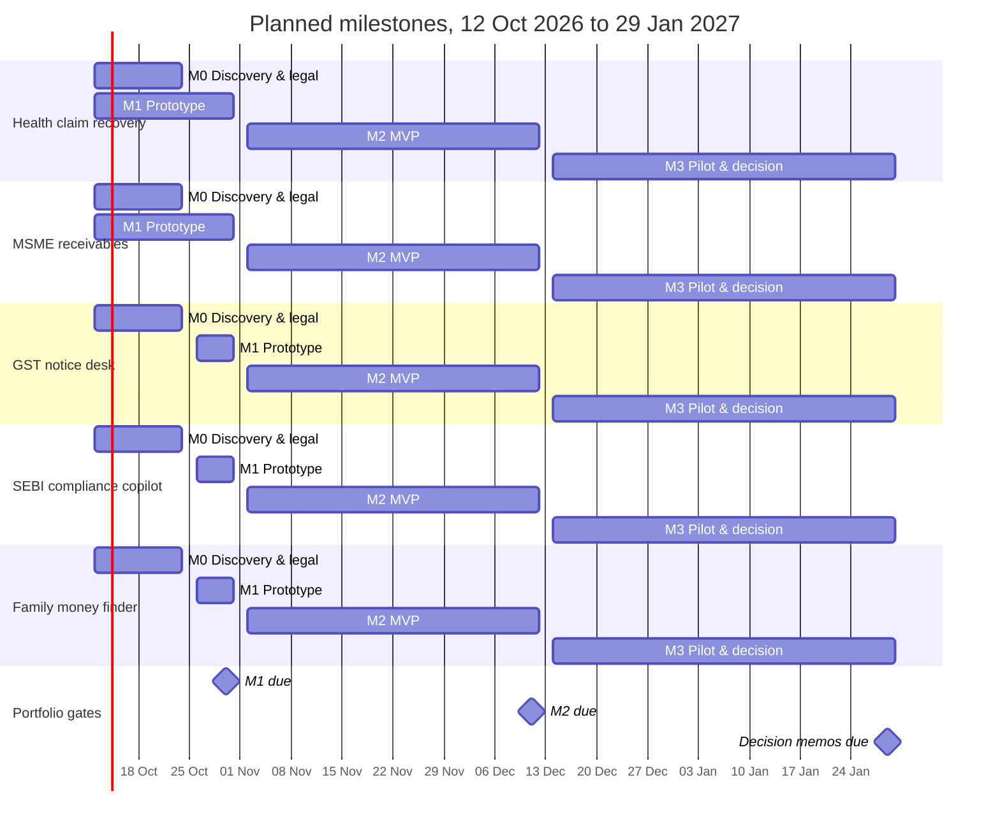

# AI Finance Ventures — Portfolio

Five AI products for Indian personal and small-business finance, each prepared as its own private repository with a handoff, a prototype-and-MVP plan, decision records, research notes, milestones and a seeded issue backlog. All five are at the same stage: **pre-prototype, planning, as of 8 October 2026**, with a planned start on **Monday 12 October 2026**.

This folder is the portfolio index. It may become a sixth "tracker" repository or stay as an index; links to the venture folders below work in this workspace and should point to the GitHub repositories of the same names once those are pushed.

## The five ventures

Scores are the weighted scores (out of 5) from the research report's opportunity matrix (Table 10, 14 ideas). Each repository's plan assumes its own dedicated team of one to three people; see [Sequencing](#recommended-sequencing-for-a-small-team) for one small team.

| Rank | Repository | One-line pitch | Score | Stage | M1 Prototype | M2 MVP | Key open legal question (counsel to confirm) |
|---|---|---|---|---|---|---|---|
| 1 | [health-claim-recovery-agent](health-claim-recovery-agent/README.md) | Recovers rejected and short-paid health-insurance claims: maps each deduction to the policy clause and IRDAI rule, drafts insurer, Bima Bharosa and Ombudsman complaints, tracks to recovery; upfront plus success fee | 4.10 | Pre-prototype, planning | Fri 30 Oct 2026 | Fri 11 Dec 2026 | May a non-lawyer service assist complainants before the Insurance Ombudsman (Advocates Act), and is a consumer success-fee contract enforceable? (unverified) |
| 2 | [msme-receivables-agent](msme-receivables-agent/README.md) | Helps micro and small suppliers get paid: computes due dates, MSMED interest and Section 43B(h) exposure, sends cited multilingual reminders, builds the Samadhaan / Facilitation Council pack; sold through CAs | 3.85 | Pre-prototype, planning | Fri 30 Oct 2026 | Fri 11 Dec 2026 | Presidential assent and commencement of the MSMED (Amendment) Bill 2026, and whether non-lawyers may assemble Council filings; the interest basis (three times bank rate, monthly rests) is also unverified |
| 3 | [gst-notice-desk](gst-notice-desk/README.md) | Reconciliation and notice desk for CA firms: matches GSTR-2B and IMS to books, ranks suppliers by ITC at risk, chases suppliers, drafts cited replies to DRC-01C, DRC-01, DRC-01B and ASMT-10 notices for CA sign-off | 3.70 | Pre-prototype, planning | Fri 30 Oct 2026 | Fri 11 Dec 2026 | Where machine drafting ends and representation begins (only authorised professionals represent; the CA files), and who bears liability for a flawed draft (unverified) |
| 4 | [sebi-compliance-copilot](sebi-compliance-copilot/README.md) | Checks every post and broadcast of RIAs, RAs, PMS, brokers and top MFDs against SEBI's Common Advertisement Code, prepares the 24-hour report pack and keeps tamper-evident evidence | 3.65 | Pre-prototype, planning | Fri 30 Oct 2026 | Fri 11 Dec 2026 | Notified text and effective date of the Common Advertisement Code (approved 24 Sept 2026; unconfirmed), plus the "no licence" position and offshore model processing for regulated firms |
| 5 | [family-money-finder](family-money-finder/README.md) | Finds a deceased parent's unclaimed money (banks, IEPF shares, mutual funds, insurance, EPF), builds each institution's claim pack and tracks claims to payment; flat Estate Pack plus capped success fee | 3.60 | Pre-prototype, planning | Fri 30 Oct 2026 | Fri 11 Dec 2026 | Whether drafting indemnities, affidavits and legal-heir declarations is legal practice, how DPDP treats a deceased person's data, and whether offshore LLM processing of PAN and death certificates is acceptable (unverified) |

Common milestones in every repository: **M0 Discovery & legal** (Fri 23 Oct 2026), **M1 Prototype** (Fri 30 Oct 2026), **M2 MVP** (Fri 11 Dec 2026), **M3 Pilot & decision** (Fri 29 Jan 2027).

## Recommended sequencing for a small team

The five plans each assume a dedicated team. A single team of two or three people cannot run five discovery programmes, five legal opinions and five pilots at once; the recommendation below (an inference from the report's scores, sensitivity analysis and profiles) concentrates build effort and keeps the other tracks warm cheaply.

1. **Build health-claim-recovery-agent first, on its repository dates.** It ranks first (4.10) and stays first under both alternative weightings in the report's sensitivity analysis (4.00 and 4.20). The pain is regulator-sized (about ₹26,037 crore of health claims rejected or disallowed in FY24), no licence is needed if the product takes no insurer money and sells no policies, the economics are a consumer success fee, and no AI-native competitor was found. Its 29 January 2027 decision memo is the portfolio's main decision point.
2. **Run family-money-finder as the second module on the same engine.** Both products ingest documents, apply deterministic rules to a versioned, sourced corpus, generate document packs, pass every outbound document through a human reviewer and track claims to payment (about 70% stack reuse, an inference in the report, which calls it "a strong module to add" to health-claim recovery). Do its M0 work now (institution requirement matrix, 20 family interviews, legal opinion, which overlaps with the health venture's Advocates Act question) and build its packs on the health venture's engine rather than in parallel. It is also the named redeploy path if health-claim recovery fails its recovery gate, and health-claim users with elderly parents are its warmest leads.
3. **Treat GST, SEBI and MSME as B2B tracks: discovery now, one build decision in late January 2027.** They sell to businesses (CA firms or SEBI intermediaries), not households, so they need different channels, sales cycles and evidence. Until the health M3 decision, each runs at low cost: interviews, design-partner commitments, a legal scoping call, and the regulatory watch. Then pick one to build on the evidence.
   - **sebi-compliance-copilot** is the most time-sensitive: the Common Advertisement Code was approved on 24 Sept 2026 and the draft's six-month transition would end around H1 2027 if notified soon. It is highly feasible (licensing and build both score well) but the market is small (about ₹22 crore a year at 100% penetration, an assumption), so the report positions it as a second product or cash side line. Keep a weekly watch on sebi.gov.in; if the code is notified with a firm date, it is the fastest B2B build.
   - **gst-notice-desk** has the most reachable paying buyer (98,967 CA firms, a proven ICAI member-benefits channel) but the weakest white space (2 of 5) because Tally and Clear are bundling AI. Interviews must show that CAs pay for the action and notice layer, not reconciliation.
   - **msme-receivables-agent** has the largest ceiling (it ranks second at 3.85 and stays second when ceiling is weighted 25%) but the hardest distribution (2 of 5); it depends on the CA channel and on the unconfirmed MSMED amendment. Sequence it after or alongside the GST desk so both share CA relationships: each venture's handoff names the other as its pivot or expansion.

If the health M3 memo says "continue", the next build is the family money finder module plus the strongest B2B track. If it says "pivot to B2B2C" or "stop", the shared engine and the B2B discovery evidence decide where the team goes next.

## Shared components

Five capabilities recur across the plans. Building them once, behind clean interfaces, is the main source of leverage.

| Component | What it does | Health | MSME | GST | SEBI | Family |
|---|---|---|---|---|---|---|
| **Document intake** | Consent-first upload by web, WhatsApp, email forward or export; parsing and extraction with page references; untrusted input treated as data | Policy wordings, letters, bills | Tally, Excel, CSV ledgers; bank files | 2B, IMS, registers; notice PDFs | Posts, URLs, WhatsApp exports | Death certificates, relationship proofs, CAS |
| **Retrieval over a versioned corpus** | Hybrid keyword and vector search over sources with effective dates; mandatory citations; quote validation | Wordings, IRDAI rules | MSMED Act, 43B(h), Samadhaan procedure | CGST Act, rules, circulars | CAC, circulars (rule packs) | Institution procedures |
| **Deterministic calculators and rules** | Every number, date and threshold comes from tested code, never the model; a validator blocks untraceable figures | Deductions, co-pay, deadlines | Due date, interest, 43B(h) exposure | Matching tiers, ITC at risk | Follower thresholds, 24-hour clock | Route and requirement matrix |
| **Review console** | Queue, evidence side by side, edit with reason codes, approve or reject; nothing leaves without a named human | Every letter | Campaigns, formal notices | CA sign-off gate | Compliance reviewer | Every pack |
| **Append-only audit log** | Hash-chained events: inputs, retrieved sources, tool calls, model and prompt versions, edits, approvals | Yes | Yes | Yes | Yes, plus object-lock evidence | Yes |

Also shared: golden-set evaluation harnesses gated in CI, consent and deletion flows built to the DPDP standard (duties bind from about May 2027), and deadline trackers.

**Stack divergence (decision needed).** The plans currently differ in language: health-claim recovery, MSME and GST use a Python core (FastAPI), while SEBI and family money finder are TypeScript and Next.js. The family money finder's decision log designs its engine packages for reuse by the health venture, which only works if the two share a language. Settle one core language for the shared components before M1 build starts (week 2), and record it in both repositories' decision logs.

## Consolidated timeline

All five repositories plan the same milestone dates. Health and MSME run M1 build across weeks 1 to 3 (overlapping M0); GST, SEBI and family money finder put M1 in week 3. Under the small-team sequencing above, the B2B tracks would run only their M0 work on these dates and re-plan M1 to M3 after 29 January 2027.

Bars end on the milestone's Friday (the chart's end dates are exclusive). Within-milestone checkpoints differ by venture, for example the SEBI week 6 checkpoint (Fri 20 Nov 2026) and the day-90 checkpoints on Fri 8 Jan 2027 (SEBI, family money finder).

## Portfolio risks

| Risk | Ventures | Mitigation |
|---|---|---|
| **Team capacity.** Five plans each assume a dedicated team of one to three | All | Sequencing above; one build track at a time plus low-cost discovery |
| **Unauthorised legal practice.** Drafting complaints, notices, filings or affidavits may count as legal practice; representation rules are unverified | Health, MSME, GST, Family | Commission opinions in week 1, sharing the Advocates Act analysis across ventures; the user or CA always signs and files; "drafting software plus service" positioning |
| **Wrong number or invented citation** harms a user's case | All | Deterministic calculators, mandatory citations with quote validation, golden-set gates in CI, human review of every outbound document |
| **Data protection.** Health data, PAN, death certificates and client data sent to offshore model APIs; DPDP duties bind from about May 2027 | All | Minimisation and redaction before model calls, zero-retention vendor terms, India hosting where available, deletion and breach drills; counsel on cross-border processing |
| **Regulatory timing.** Unconfirmed SEBI ad-code notification and MSMED amendment assent | SEBI, MSME | Versioned rule packs with status flags; cite only confirmed provisions; contingency scenarios in each plan |
| **Incumbent bundling.** Tally (TallyIra), Clear and Suvit in the CA channel; free MFD platforms | GST, MSME, SEBI | Own the action, escalation and evidence layer; stay compatible, not dependent; kill triggers in each handoff |
| **Channel overlap.** GST and MSME both sell through CAs | GST, MSME | One CA relationship programme for both; avoid pitching two products to the same CA in the first contact |
| **Weak evidence base.** Most figures are secondary reporting; several conflict (FY25 Ombudsman totals, RBI DEA Fund balances from ₹67,000 to ₹98,073 crore, insurance unclaimed totals) and the ₹8.1 lakh crore overdue-receivables figure is company-sourced | All | Primary verification is an M0 task in every backlog; conflicting figures stay flagged |
| **Willingness to pay and fee collection** are untested | All | Charge from the first concierge case where counsel allows; collection rate is a kill metric |
| **Shared-engine coupling.** A shared core delays the module that depends on it, and the plans currently use two languages | Health, Family | Decide the core language before M1; version the shared packages; keep each venture shippable alone |

## How tracking works

- **Each venture is its own private repository** with issues, labels (`type:*`, `priority:*`) and the four milestones. The backlog in each `planning/issues.json` (198 issues in total) is created with [scripts/seed_github.py](scripts/README.md), which is idempotent and has a no-network `--dry-run`.
- **One GitHub Projects board, "AI Finance Ventures",** collects every issue. It adds Venture, Priority, Type, Status (Backlog, Ready, In progress, In review, Done) and Target date fields, and three views: Board by Status, Table by Venture and Roadmap by Target date. Auto-add workflows (filter `is:issue`) bring in new issues from each repository. Setup: [PROJECT_BOARD_SETUP.md](PROJECT_BOARD_SETUP.md).
- **Rhythm.** Monday triage per venture; Friday milestone check on the Table view; each milestone closes against the exit criteria in that repository's `planning/milestones.md`; decisions go into each repository's `docs/DECISIONS.md`.
- **Source of truth.** Each repository's `docs/HANDOFF.md` holds the product facts and sources; plans, milestones and issues derive from it. Portfolio-level decisions (sequencing, shared stack) should be recorded here once this folder becomes the tracker repository.

| File | Purpose |
|---|---|
| [PROJECT_BOARD_SETUP.md](PROJECT_BOARD_SETUP.md) | Step-by-step setup of the GitHub Projects board, fields, views, workflows and bulk-add |
| [scripts/seed_github.py](scripts/seed_github.py) | Creates labels, milestones and issues in a venture repository from its `planning/` folder |
| [scripts/README.md](scripts/README.md) | Script usage, token permissions and test notes |

*Planning material only: not legal, tax, medical or investment advice. Regulatory points marked unverified need confirmation by counsel.*
