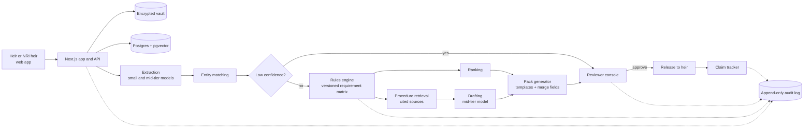

# Prototype and MVP Plan

*As of 8 October 2026. Plan start: Monday 12 October 2026. **Inference** = team judgement, not sourced. **Assumption** = number to replace with pilot data. **Conflict** = sources disagree. **Unverified** = legal or regulatory point that counsel or a primary document must confirm. Scope, pricing hypotheses and open legal questions come from [HANDOFF.md](HANDOFF.md); this document turns them into a build and validation plan.*

## 1 Goals and non-goals

**Goals**

1. Learn, with real consented families, whether a sweep across banks, shares, mutual funds, insurance and EPF finds money the family did not know about (target: at least 50% of families).
2. Produce per-institution document packs that institutions accept without rework (at least 70% first-submission acceptance; at least 95% requirement accuracy against expert-verified ground truth).
3. Find out whether families pay a flat Estate Pack plus a modest success fee (at least 30% fee acceptance).
4. Reach a continue, pivot or stop decision on 29 January 2027 against the thresholds in [HANDOFF section 11](HANDOFF.md).
5. Build the smallest system that is safe to operate: deterministic rules, human review of every outbound document, an audit log, and data handling to the DPDP standard from day one.

**Non-goals (through the pilot)**

- Handling client money; investment advice on inherited assets; court filings or succession and probate petitions (refer to an advocate); contested estates; property, vehicles and foreign assets.
- Autonomous portal login, scraping behind a login, or OTP handling.
- Account Aggregator or DigiLocker integration; fine-tuning any model; institution submission APIs; white-label partner dashboard; the living-parent nominee audit.
- Scale: the pilot serves tens of families, not the 100 by week 12 in the HANDOFF funnel (flagged in section 3).

## 2 Prototype, MVP and Pilot defined

| | Prototype (M1) | MVP (M2) | Pilot (M3) |
|---|---|---|---|
| **Question** | Can we find money and produce a correct pack for the three most common institution types, with the team doing the manual work? | Can a two-person team run the full flow in under 3 reviewer hours per family using software, not spreadsheets? | Do families pay, are packs accepted, and does money start to move? |
| **Users** | 10 to 15 consented families, served by the team | Heir and NRI-heir intake plus reviewer console; 5 dry-run families | 40 to 50 families (assumption), at least 10 NRI cases |
| **Automation** | Rules and pack generation tooled; extraction and matching mostly manual | Extraction, matching, rules, packs and tracker automated; review stays manual | Same as MVP; fixes only |
| **Money** | Free discovery scan; fee terms shown at the end to test intent | No charge until counsel clears terms | Flat Estate Pack plus capped success fee (hypothesis, ADR-004) |
| **Exit** | Demo plus baseline eval numbers | Eval gates green in CI | Decision review against HANDOFF section 11 |

## 3 Timeline

Team: 1 to 3 people from 12 October 2026 (product and operations lead, full-stack or AI engineer, part-time reviewer) plus retainer advisors (counsel, a CA, an advocate). Dates assume at least two full-time people; with one, M2 moves and M1 stays.

**Planning choice (flag).** HANDOFF section 10 plans 12 weeks with a day-90 review near 10 January 2027. This plan runs 16 weeks to 29 January 2027 so pilot claims have time to move. A **day-90 checkpoint** stays on Friday 8 January 2027. Diwali (around 8 November 2026, unverified) and year-end holidays slow institutions; a buffer is built in (assumption).

| Milestone | Dates | Weeks | Outcome |
|---|---|---|---|
| **M0 Discovery & legal** | Mon 12 Oct to Fri 23 Oct 2026 | 1-2 | Procedures and thresholds compiled; legal opinion commissioned; 20 family interviews |
| **M1 Prototype** | by Fri 30 Oct 2026 | 3 | Concierge search for 10 to 15 families; knowledge base; packs for three institution types; eval harness |
| **M2 MVP** | by Fri 11 Dec 2026 | 4-9 | Full flow in software; golden-set gates green |
| **M3 Pilot & decision** | through Fri 29 Jan 2027 | 10-16 | Paid pilot; decision review |

M1 is tight. If the M0 matrix is under 60% complete for the top institutions on 23 October, M1 slips one week and the slip is recorded in [planning/milestones.md](../planning/milestones.md).

### Week by week

| Wk | Dates | Focus | Deliverables |
|---|---|---|---|
| 1 | 12-16 Oct | M0 | Counsel engaged; competitor sweep finished (fee-based IEPF agents, will and estate startups); repo, CI, landing page; interview recruiting; matrix template; first 10 institutions chosen |
| 2 | 19-23 Oct | M0 | 20 interviews done (adult children, NRIs, a few CAs and advocates); succession, legal-heir and indemnity thresholds and procedures compiled for top banks, CAMS, KFintech, top insurers and IEPF, each with source and date; DEA Fund figures verified; 3 families recruited |
| 3 | 26-30 Oct | M1 | Concierge sweep for 10 to 15 families; knowledge base loaded; packs for banks, mutual-fund RTAs and IEPF; harness with 30 golden items; demo on 30 Oct |
| 4 | 2-6 Nov | M2 | Legal opinion draft (hard gate, section 9); intake, consent and authority check; vault and encryption; auth; CI eval job; model-hosting decision |
| 5 | 9-13 Nov | M2 | Document extraction; profile builder; entity matching with reviewer queue (Diwali week: light outreach) |
| 6 | 16-20 Nov | M2 | Rules engine v1; route selection; ranked claim list |
| 7 | 23-27 Nov | M2 | Packs for all five asset classes; reviewer console; release checklist |
| 8 | 30 Nov-4 Dec | M2 | Claim tracker, reminders, escalation drafts; audit log; heir status page; payments in test mode |
| 9 | 7-11 Dec | M2 | NRI remote-consent flow; golden set at 60; dry run on 5 families; M2 review 11 Dec |
| 10 | 14-18 Dec | M3 | Counsel-cleared terms live; pilot onboarding; first paid families |
| 11 | 21-25 Dec | M3 | Serve families; weekly eval run; fix top reviewer-edit causes (holiday week) |
| 12 | 28 Dec-1 Jan | M3 | First submissions tracked; local representatives in two cities |
| 13 | 4-8 Jan | M3 | **Day-90 checkpoint (8 Jan)**: interim metrics against HANDOFF section 11 |
| 14 | 11-15 Jan | M3 | Partner outreach (CAs, advocates, advisers) with anonymised results; Project 1 cross-sell test |
| 15 | 18-22 Jan | M3 | Freeze features; chase queries; collect outcomes and cost per family |
| 16 | 25-29 Jan | M3 | Decision review on 29 Jan: continue, pivot or stop |

**IEPF claims are slow.** Form IEPF-5 plus company verification is the slowest route and no source gives a typical duration ([HANDOFF section 12](HANDOFF.md)). Pilot metrics therefore use leading indicators:

| Stage | Indicator |
|---|---|
| Found | Asset discovered and confirmed with the family |
| Ready | Pack released after review |
| Filed | Claim submitted; reference number or acknowledgement received |
| Engaged | Institution raised a query or moved the claim to verification |
| Paid | Money received by the claimant |

Report "paid" with and without IEPF at day 90 and week 16. HANDOFF's proposed signals apply: at least 10 claims paid is a continue signal; zero paid outside IEPF is a stop signal.

## 4 Prototype specification (M1, by 30 October 2026)

**Scope.** A concierge service for 10 to 15 consented families (assumption: recruited from the interviews and the team's networks), with tooling only where it must be proven:

1. **Search and ranking.** The team builds each profile (name variants, PAN, DOB, addresses), guides the family through UDGAM, IEPF, MITRA or CAS upload, insurer pages and EPFO, and records hits in a structured sheet. The family performs every login and OTP.
2. **Procedures knowledge base.** The M0 requirement matrix (documents, forms, thresholds, branch versus online, nominee versus legal-heir route), each entry with source and date.
3. **Pack generator for the top three institution types:** banks (deceased depositor claims, including UDGAM hits), mutual-fund RTAs (CAMS, KFintech) and IEPF (Form IEPF-5 pack). Every family has banks and folios, and IEPF holds the largest pool (₹89,004 cr, 30 Nov 2025). Insurance and EPF packs come in M2. **Assumption:** revisit after the interviews.
4. **Eval harness** with 30 claim-level golden items (assumption: 10 to 15 families yield about 30 claims).

| Step | Prototype mode |
|---|---|
| Consent and authority check | Manual checklist; death certificate and relationship proof seen before any deceased-person search |
| Extraction | Operator keys data into the profile form; no model reads identity or death documents |
| Portal searches | User-assisted, guided by the operator |
| Matching | Operator, with a script suggesting name-variant matches |
| Route and requirements | Rules engine prototype over the matrix |
| Pack documents | Merge-field templates; the model drafts only the cover letter and plain-language explainer from structured, masked fields |
| Review | Reviewer checks every document before release |
| Tracking | Spreadsheet and calendar reminders |

**Conservative default (assumption).** Until counsel answers whether offshore LLM processing of PAN and death certificates is acceptable (HANDOFF question 4), only masked, structured fields go to a model API. Model extraction begins in M2 week 5, after the week 4 opinion or an India-region deployment decision.

**Demo script (about 10 minutes, synthetic family).**

1. An adult child consents; the operator verifies the death certificate and relationship proof.
2. Name variants are generated; a spelling mismatch between a bank record and the PAN is flagged.
3. Guided UDGAM, IEPF and MITRA searches run; hits are recorded.
4. A ranked list of five claims appears, one IEPF claim marked "slow, flat-priced".
5. For a bank hit, the rules engine shows the nominee or legal-heir route and cites the matrix entry.
6. The generator produces claim form, indemnity draft, affidavit draft, checklist and cover letter.
7. The reviewer rejects one item for a missing document; the pack is corrected and released.
8. The harness replays the golden set and prints requirement accuracy.

**Success criteria**

- At least 10 families served; at least 3 NRI heirs interviewed.
- Baselines recorded for requirement accuracy (M1 target at least 90% on the three types, assumption), route accuracy, name-match precision and recall, and reviewer time per family.
- Share of families with a previously unknown claimable asset measured (continue signal: at least 50%).
- At least 6 packs prepared, 3 submitted, and feedback from at least 3 institution desks or branches on completeness.
- Every reviewer edit logged with a reason code.

## 5 MVP specification (M2, by 11 December 2026)

### User stories

| ID | Persona | Story | Pri |
|---|---|---|---|
| H1 | Heir | I upload the death certificate and relationship proof so the service may search for my parent's assets | P0 |
| H2 | Heir | I consent in plain language and can withdraw consent and request deletion | P0 |
| H3 | Heir | I see a ranked list of what was found, with value, difficulty and usual timeline, before paying beyond the scan | P0 |
| H4 | Heir | For each institution I get the exact documents in order and a pre-filled pack | P0 |
| H5 | Heir | I see where each claim stands and what I must do next, with no upsell in the first message | P0 |
| H6 | Heir | I can use the app in Hindi, and pay the flat fee and a capped success fee by e-mandate | P1 |
| N1 | NRI heir | I give remote consent and identity proof without visiting a branch | P0 |
| N2 | NRI heir | I see which steps need a local representative, and get a repatriation checklist (NRO cap $1M a year; Forms 15CA and 15CB via a CA) | P1 |
| R1 | Reviewer | I work from a queue with flagged items: low-confidence matches, missing documents, rule warnings | P0 |
| R2 | Reviewer | I approve, edit or reject each outbound document against a checklist, with a reason code | P0 |
| R3 | Reviewer | I see the source and effective date behind every requirement | P0 |
| R4 | Reviewer | I log outcomes (amount, days elapsed, queries) and, with consent, add the case to the golden set | P0 |
| R5 | Reviewer | I escalate to the advocate or CA from a case and record the referral | P1 |

### Screens

Landing and consent; authority check and upload; profile confirmation; search guide (one asset class per step); ranked claim list; claim detail and pack download; status timeline; payment and terms; reviewer queue; reviewer case view with checklist and diff; matrix and sources admin; audit view.

### Acceptance criteria

- No pack reaches a family without a recorded reviewer approval.
- Every requirement links to a matrix entry with source, retrieval date and verifier.
- Golden set: requirement accuracy at least 95%, zero critical omissions, route accuracy at least 95% (assumption).
- A deceased-person search cannot start before the authority check is approved.
- Deletion on request removes documents, extracted fields and embeddings, verified by test.
- Five dry-run families complete end to end, each under 3 reviewer hours (target).
- Model output is never the source of a threshold, form name or amount; the build fails if a template field lacks a rule or source.

## 6 Technical design

### Architecture



Portal searches are not an automated box: the heir searches the official portals with their own logins and OTPs, and the app supplies inputs and records results.

### Stack and justification

| Layer | Choice | Why |
|---|---|---|
| App and API | TypeScript, Next.js | One language for UI, API, rules, templates and eval; suits a small team |
| Data | Postgres with pgvector on Supabase (India region, to confirm) | Relational claims plus vector search; row-level security; managed backups |
| Storage and auth | Supabase storage with per-case keys; Supabase Auth | Encrypted vault; fewer moving parts |
| Models | Claude API: mid-tier (Sonnet class) for document understanding and drafting; small (Haiku class) for classification and matching; model identifiers pinned and logged | Reads PDFs and photos directly; cost near HANDOFF's ₹150 per family; no fine-tuning (ADR-006) |
| Rules engine | TypeScript over a versioned YAML requirement matrix | A right answer must be deterministic, testable and reviewable by a non-engineer |
| Documents | HTML to PDF for letters and affidavit drafts; DOCX for editable drafts; AcroForm filling for fillable official forms | The model never invents a form field |
| CAS parsing | `casparser` in a small Python worker | Fallback when MFCentral pulls are curtailed ([tech_feasibility.md](research/tech_feasibility.md)) |
| Eval | Vitest plus a golden-set runner in CI | One runner for rules and model output |
| Payments | Razorpay or similar, test mode in M2 | Flat fee first; success-fee e-mandate later (RBI rules effective 21 Apr 2026: 24-hour pre-debit notice, extra authentication above ₹15,000) |

**Portal search is user-assisted** ([ADR-001](DECISIONS.md)): the product never stores portal credentials, automates a login, or handles OTPs.

### Data model (core tables)

| Table | Key fields |
|---|---|
| `family`, `person` | roles (heir, NRI heir, deceased, other heir), name variants, DOB, PAN (field-encrypted), residency |
| `authority_check` | documents verified, verifier, decision, timestamp |
| `asset_found` | asset class, institution, masked identifier, estimated value, source, match confidence |
| `claim` | route, state, rank score, expected days, filed date, acknowledgement reference, outcome amount, paid date |
| `document` | type, storage key, extracted fields, redaction status, retention date |
| `pack`, `pack_item` | version, template, rendered document, reviewer decision, reason code |
| `institution`, `procedure` | required documents, forms, thresholds (null until verified), channel, source URL, retrieved on, verified by, effective from and to, version |
| `procedure_chunk` | text and embedding for retrieval only, never a source of thresholds |
| `audit_event` | append-only: actor, action, entity, prompts, retrieved ids, tool calls, rule and model versions, reviewer, user confirmations |
| `golden_item` | claim-level input, expected requirements and route, expert, consent reference |

Thresholds, such as the value below which an institution accepts an indemnity in place of a succession or legal-heir certificate, are institution-specific and absent from the research notes ([HANDOFF section 5](HANDOFF.md)). The field stays null until an entry has a source and verifier, and the engine then answers "unknown, ask the institution".

### Rules engine, retrieval and review

Inputs: asset class, institution, nominee present, joint holder, balance bucket, will present, number of heirs, claimant residency. Outputs: route, ordered documents, forms, channel, warnings, and the matrix entry ids behind each line. Entries carry effective dates, so a case is evaluated against the entry that applied on its filing date. Illustrative entry (placeholders, not real thresholds):

```yaml
institution: EXAMPLE_BANK
asset_class: bank_deposit
route: legal_heir_without_nominee
threshold_inr: null        # TBD until sourced and verified
documents: [death_certificate, claimant_id, relationship_proof, indemnity_bond]
source_url: <institution procedure page or circular>
retrieved_on: 2026-10-22
verified_by: <expert>
```

Retrieval returns matrix entries and source passages with citations. The mid-tier model may explain a requirement in plain language and draft a cover letter, but only from fields supplied by the rules engine or a cited passage. A validator rejects any output containing a threshold, amount, form number or date absent from its inputs. Every outbound document passes a human reviewer ([ADR-003](DECISIONS.md)).

Claim states: `draft -> in_review -> released -> filed -> acknowledged -> query_raised -> approved -> paid`, with `rejected` and `withdrawn` exits. Each transition writes an audit event.

### Security and privacy

- **Data handled:** PAN, bank statements, death certificates, relationship proofs. DPDP Rules were notified in November 2025 with core duties from about May 2027; IT Act SPDI Rules apply meanwhile; build to the DPDP standard now ([regulation_and_rails.md, Q8](research/regulation_and_rails.md)).
- **PAN:** field-level encryption; masked in logs, lists and prompts; unmasked only in forms that require it.
- **Aadhaar (unverified, counsel to confirm):** private entities may be restricted from collecting or storing full Aadhaar numbers. Default: do not store the full number; accept a masked copy and redact at upload.
- **Death certificates and relationship proofs:** per-case keys; assigned reviewers only; excluded from model prompts until the hosting decision.
- **Access and logging:** role-based access; reviewer actions logged; no customer data in third-party analytics; no training on customer data; vendor data-processing agreements.
- **Retention and deletion:** 90 days after closure by default (assumption); deletion on request across storage, fields and embeddings; quarterly deletion test.
- **Deceased persons' data:** treatment under DPDP is open (HANDOFF question 3); the authority check is the working control.
- **Breach readiness:** a drill before the pilot opens; DPDP penalties reach ₹250 cr for security failures.

## 7 Code layout

```text
family-money-finder/
  apps/web/            # Next.js: heir app, reviewer console, admin
  packages/
    rules/             # matrix loader, route and ranking functions
    matrix/            # versioned YAML requirement matrix (reviewed like code)
    documents/         # templates, merge-field schema, PDF/DOCX renderers
    llm/               # model client, prompts, output validators, redaction
    retrieval/         # chunking, embeddings, citation assembly
    tracker/           # claim state machine, reminders
    audit/             # append-only logger
  workers/cas-parser/  # Python, casparser wrapper
  eval/
    golden/            # synthetic or consented items; no real family data in repo
    runners/           # requirement, route, matching, search-recall runners
  supabase/migrations/
  docs/  planning/
```

## 8 Evaluation plan

**Ground truth.** A CA or advocate signs off each golden item, backed by the institution's published procedure or a written reply. The set starts at 30 claim-level items in M1, reaches 60 by the end of M2 and about 150 by the end of M3 (assumption). Items come from consented concierge cases (stored outside the repo, identifiers removed) and synthetic families built from the matrix.

| Metric | Definition | M1 | M2 gate | M3 gate |
|---|---|---|---|---|
| Requirement accuracy | Generated document list matches the expert list | at least 90% | at least 95% | at least 95% |
| Critical omissions | A mandatory document or form missing | record | 0 | 0 |
| Route accuracy | Correct nominee, joint-holder, legal-heir or succession-certificate route | record | at least 95% (assumption) | same |
| Name match | Precision and recall across spelling variants on seeded test families | record | at least 95% and 85% (assumption) | same |
| Search recall | Share of assets planted in synthetic test families, plus assets later confirmed by consented families, that guided search plus matching surfaces | record | at least 80% (assumption) | same |
| Reviewer edit rate | Pack items edited or rejected | record | under 25% (assumption) | under 15% (assumption) |
| First-submission acceptance | Packs accepted without rework | record | n/a | at least 70% |
| Unsupported statements | Thresholds, amounts or forms in model output not in its inputs | 0 | 0 | 0 |

**Regression tests.** The runner executes in CI on every change to a prompt, model identifier, template or matrix entry. A pull request fails if a gate drops, a critical omission appears, or a previously passing item fails. Changing a matrix entry requires re-verifying affected items. A weekly job diffs institution source pages and prompts the verifier. Reviewer reason codes (missing document, wrong form, wrong route, wrong threshold, name mismatch) feed a weekly review of the top three causes.

## 9 Legal and compliance gates

| Gate | Needed by | Condition |
|---|---|---|
| Opinion on the six questions in [HANDOFF section 7](HANDOFF.md) | Draft 6 Nov (week 4); final before charging | No paid case, and no model processing of identity or death documents, until the relevant answer is in hand |
| Power of attorney | Before first submission | Scope of any POA from a living claimant recorded in writing; a POA from the deceased ends at death (general principle, not in the sources; counsel to confirm) |
| Representation | Before first submission | The claimant signs and submits; the product never signs for the claimant and refers court work to an advocate |
| Fee structure | Before first paid case (week 10) | Terms reviewed by counsel; flat Estate Pack first, success fee low and capped; no commission from institutions; no referral fees until question 2 is answered |
| Authority check | Before any deceased-person search | Death certificate and relationship proof verified and logged |
| Disclosure | Before first family | Plain statement that AI drafts and a human reviews every document |
| Entity and policies | Before first paid case | Private limited company; written no-money-handling, no-advice, refund and complaint policies; vendor DPAs |

## 10 Cost estimate (labelled)

All figures are assumptions unless sourced; conversion at ₹88 per US dollar (assumption).

| Item | Basis | Estimate |
|---|---|---|
| Team | ₹3 lakh a month (HANDOFF break-even assumption) for about 3.7 months | about ₹11 lakh |
| Legal opinion and terms review | Quotes pending | ₹1.5 to ₹3 lakh |
| Interview incentives | 20 interviews | about ₹0.1 lakh |
| M1 concierge variable cost | 15 families, about 6 reviewer hours at ₹500 each plus out-of-pocket | about ₹0.5 lakh |
| Pilot variable cost | 50 families x ₹2,050 (HANDOFF unit economics) | about ₹1.0 lakh |
| Hosting and tools | ₹3 to ₹10 thousand a month hosting (research estimate) plus tools | ₹0.1 to ₹0.4 lakh |
| **Total** | | **about ₹14 to ₹16 lakh** |

Model cost per family: about 60 document pages and 20 drafting calls, roughly 250k input and 30k output tokens (assumption). At the list prices in [tech_feasibility.md](research/tech_feasibility.md) (Haiku class $1 / $5, Sonnet class $3 / $15 per million tokens; third-party aggregators, verify), that is about $1 to $2 (about ₹90 to ₹180), consistent with HANDOFF's ₹150. Pilot revenue is not counted as an offset.

## 11 Definition of done

| Milestone | Done when |
|---|---|
| **M0** | Matrix covers the first 10 institutions with source and date; legal opinion commissioned; 20 interviews logged and synthesised; DEA Fund and insurance figures verified or still flagged; competitor sweep closed |
| **M1** | Demo script runs; at least 10 real families served; three pack types pass the reviewer checklist; baseline eval numbers committed; reason-coded edits recorded |
| **M2** | All P0 stories meet acceptance criteria; 60 golden items with M2 gates green in CI; five dry-run families complete; audit, deletion and breach drill demonstrated; opinion received |
| **M3** | At least 40 families onboarded (assumption); metrics reported against HANDOFF section 11 with and without IEPF at day 90 and week 16; decision memo written |

## 12 Timeline risks and dependencies

| Risk or dependency | Response |
|---|---|
| Institution rules are hard to obtain or differ by branch | Prioritise 10 institutions; call nodal officers; grade "branch-reported" as lower evidence |
| Counsel opinion arrives late | Commission in week 1; keep the conservative default on identity images |
| Recruiting grieving families | Start in week 1; use CAs, advocates and NRI groups; offer the free scan |
| Diwali and year-end holidays | Plan low-volume weeks 5 and 11 to 12; use leading indicators |
| Portal changes or outages | User-assisted design tolerates change; version the search guides |
| One-person team | Cut P1; keep review console and tracker |
| Government portals are data sources | No scraping; keep CAS upload fallback |
| Hosting decision (offshore LLM or India region) | Decide in week 4; keep the model client behind one interface |

## 13 Cross-sell with the health-claim-recovery project

Both products share one engine: ingestion, rules, pack generation, review console and tracking (about 70% stack reuse, inference, per the [research report](research/00-full-research-report.md)). The `rules`, `documents`, `audit` and `tracker` packages are written so a second claim domain can reuse them. Project 1 users with elderly parents are the warmest Estate Pack leads, and a death often leaves pending health and life claims (assumption). Week 14 includes a small cross-sell test if Project 1 is live. If health-claim recovery fails its gates, this product is the redeploy path named in the report.
