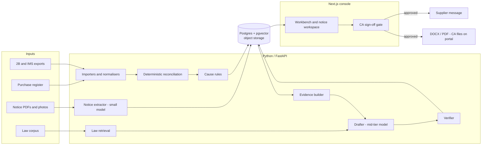

# Prototype and MVP Plan

Status: draft v0.1, 8 October 2026. Companion to [HANDOFF.md](HANDOFF.md), which holds the market case, pricing and risks. This document is the build plan for a dedicated team of one to three people starting **Monday 12 October 2026**.

Labels follow HANDOFF.md. **Fact** is sourced and linked. **Assumption** or **estimate** is a working number to replace with data. **Unverified** means background knowledge or a weak source; confirm before relying on it.

## 1 Goals and non-goals

**Goals.**
1. Show on real (anonymised) CA-firm data that a deterministic engine matches GSTR-2B to purchase registers at CA-grade accuracy and ranks suppliers by rupees of ITC at risk.
2. Show that machine-drafted replies to templated notices (DRC-01C, DRC-01, DRC-01B, ASMT-10) need editing, not rewriting, with every legal statement cited and every figure tool-computed.
3. Ship an MVP a CA firm can run for a full monthly cycle without the team present.
4. Decide go, pivot or stop on 29 January 2027 against [HANDOFF section 11](HANDOFF.md).

**Non-goals through M3.** Filing or sending anything to a tax authority (the CA files; [ADR-002](DECISIONS.md)); return preparation, refunds, appeals, income-tax notices; becoming a GSP/ASP; a direct-to-SME app; fine-tuning; P2 items (Tally connector, regional languages, client WhatsApp approvals).

## 2 Prototype, MVP and Pilot

| Stage | Operated by | Data | Proves |
|---|---|---|---|
| **Prototype** (M1) | The team, via CLI and generated Excel/DOCX | Anonymised 2B and register exports from 3-5 design-partner firms; real anonymised notices | Matching accuracy, draft usefulness, working eval harness |
| **MVP** (M2) | CA firm staff, unaided, in a multi-tenant web app | Real client data under a signed processing agreement | End-to-end monthly workflow with review console and audit log |
| **Pilot** (M3) | 10-15 firms on live clients, two monthly return cycles | Real data | Weekly use, draft acceptance, time saved, price acceptance |

## 3 Timeline

| Milestone | Window | Due | Exit in one line |
|---|---|---|---|
| **M0 Discovery & legal** | Weeks 1-2 (12-23 Oct) | Fri 23 Oct | Paid pain confirmed; 3-5 design partners signed; teardown done; counsel engaged |
| **M1 Prototype** | Week 3 (26-30 Oct), build starts week 1 | Fri 30 Oct | Engine and drafter demoed on real anonymised data; eval numbers reported |
| **M2 MVP** | Weeks 4-9 (2 Nov-11 Dec) | Fri 11 Dec | Multi-tenant app; one firm completes a monthly cycle unaided |
| **M3 Pilot & decision** | Weeks 10-16 (14 Dec-29 Jan) | Fri 29 Jan 2027 | Decision memo against kill/pivot thresholds |

HANDOFF counts 90 days; this plan runs 109 because it adds a prototype checkpoint and a two-cycle pilot. M0 maps to HANDOFF phase 0, M1-M2 to phases 1-2, M3 to phase 3; HANDOFF's day-90 targets are the M3 thresholds.

**Compression warning.** M1 works only if partners deliver exports by 23 October; otherwise it slips to 6 November.

### Week by week

| Wk | Dates | Focus and outputs |
|---|---|---|
| 1 | 12-16 Oct | Interview script, 8+ CAs booked; counsel engaged; repo and CI; synthetic 2B/register generator; GSTIN and invoice normalisers |
| 2 | 19-23 Oct | 20 CA interviews done (HANDOFF target); teardown of Clear, Suvit, Zoho, Tally, plus Accu Reco; 3-5 partners signed; anonymiser handed out; first exports in; matching tiers 1-3 |
| 3 | 26-30 Oct | **M1.** Real exports ingested; cause rules; action-list report; 100 recon cases labelled; extractor and drafter on 15-20 notices; eval harness v0; partner demos on 30 Oct |
| 4 | 2-6 Nov | Schema, auth, tenancy, uploads, jobs; M1 fixes |
| 5 | 9-13 Nov | Import wizard; run view; mismatch table. Diwali (about 8 Nov, unverified) cuts partner availability |
| 6 | 16-20 Nov | Action list; message templates; email and assisted WhatsApp; monthly summary. Partners busy with 3B near the 20th (unverified) |
| 7 | 23-27 Nov | Notice inbox, extraction, deadline tracker; 50 consented notices collected (HANDOFF day-45 checklist) |
| 8 | 30 Nov-4 Dec | Evidence builder with numbered annexures; law corpus v1; cited drafts and verifier in app |
| 9 | 7-11 Dec | **M2.** Review console, sign-off gate, audit log, DOCX/PDF export; security checklist; regression suite green |
| 10 | 14-18 Dec | Pilot starts: 3-5 firms on live data in shadow mode (outputs not acted on) |
| 11 | 21-25 Dec | Cycle 1 on November data; first supplier chasing; fixes; holiday slowdown |
| 12 | 28 Dec-1 Jan | Hardening; recon set to 150-200 cases; price-test material |
| 13 | 4-8 Jan | Scale to 10-15 firms; live notice drafting; price test at INR 150/250/400 per GSTIN |
| 14 | 11-15 Jan | Pre-3B check dashboard; IMS recommendations (P1) |
| 15 | 18-22 Jan | Cycle 2 on December data; chase-resolution measurement; ICAI application drafted |
| 16 | 25-29 Jan | **M3.** Metrics review, case studies, decision memo, call on 29 Jan |

## 4 Prototype specification (M1)

**Scope.** Two pipelines run by the team from a command line. No login, no UI beyond generated files.

| Capability | Automated | Manual |
|---|---|---|
| Ingest 2B (portal Excel/JSON) and register (Excel, Tally export) | Parsing via a per-partner YAML column mapping | Writing each mapping |
| Match (tiers 1-4, section 6.3) and classify causes | All, rule-based | CA advisor reviews |
| Per-supplier action list with ITC at risk | Excel and HTML report | Message wording |
| Supplier chasing | Message text generated | Nothing sent |
| Notice intake (PDF/photo) | Small-model extraction, schema-validated | Partners choose and anonymise notices |
| Evidence pack | Manifest from notice type and reconciliation | Collecting ledgers and invoices |
| Draft reply | Cited DOCX from retrieval plus tool figures | CA advisor judges |
| Eval harness | Scores recon and notice sets | Labelling |

**Demo script (about 12 minutes, for a partner CA).**
1. Run the engine on that partner's anonymised files: matched share, ITC at risk, top ten suppliers by rupees.
2. Open one supplier: lines by tier, why a fuzzy match was suggested, recommended action.
3. Feed a real anonymised notice: extracted fields and deadline.
4. Show the evidence manifest and cited draft; click a citation to its source text; show each rupee figure linking to a tool output.
5. Show the eval scoreboard with failures listed.
6. Ask what must change before the partner would send this to a client; record answers verbatim.

**Success criteria (M1 exit; assumptions set against HANDOFF phase-1 gates).**
- Recon: at least 95% line-level agreement with CA labels on 100 cases; zero wrong auto-accepts in tiers 1-2.
- Extraction: deadline and demand right on at least 95% of 15-20 notices.
- Drafts: CA advisor rates at least 50% "edit, not rewrite"; 100% of citations resolve to corpus text.
- At least 3 of 5 partners would use the output on a live client; eval harness runs in one command and in CI.

Recon below 90% on real data fails M1.

## 5 MVP specification (M2)

### 5.1 User stories

Priorities follow [HANDOFF section 5](HANDOFF.md); personas are in HANDOFF section 3.

**CA partner**
- CP-1 (P0) See ITC at risk and suppliers to act on, per client and month.
- CP-2 (P0) Approve or reject recommended actions in bulk; nothing leaves unapproved.
- CP-3 (P0) Review a notice draft beside its evidence and citations, edit, sign off.
- CP-4 (P0) See who changed and approved each draft and message (audit trail).
- CP-5 (P0) See all open notices across clients by deadline.
- CP-6 (P1) Pre-3B check: ITC claimed versus available in 2B, flagging DRC-01C exposure.

**Article assistant**
- AA-1 (P0) Upload 2B and register files; map columns once.
- AA-2 (P0) Work one supplier queue with matched/unmatched lines and suggested cause.
- AA-3 (P0) Upload a notice, correct extracted fields, get deadline reminders.
- AA-4 (P0) Build an evidence pack with numbered annexures.
- AA-5 (P0) Generate a draft reply and route it to a CA reviewer.
- AA-6 (P1) Send an approved supplier message by email or prefilled WhatsApp link and log reply status.
- AA-7 (P1) Import IMS data and see accept/reject/pending recommendations (assumes IMS is downloadable from the portal; unverified).

**Client (SME owner)**
- CL-1 (P1) Receive from the CA a one-page summary of credit at risk and actions in progress.
- CL-2 (P2) Approve a supplier nudge by WhatsApp.

### 5.2 Screens

Firm dashboard; client/period run (upload, mapping, summary); reconciliation workbench (line-level matches, override with note); action list; supplier messages; notice inbox; notice workspace (evidence, draft, citations, figure provenance); review and sign-off (diff, approve, export); audit log; settings.

### 5.3 Acceptance criteria

- **AC-1 Import.** A 5,000-line run completes in under 2 minutes; the column mapping is saved.
- **AC-2 Integrity.** Every register and 2B line is in exactly one match group or the unmatched list (property test).
- **AC-3 Provenance.** Every rupee figure links to a run and its lines.
- **AC-4 Approval gate.** A non-CA user cannot approve a message or reply; the approver's name and membership number are recorded.
- **AC-5 No authority path.** No code path submits to any government system (code review plus egress allow-list).
- **AC-6 Deadlines.** Reminders fire at D-7, D-3, D-1; overdue items top the dashboard.
- **AC-7 Citations.** Every legal statement has a citation id from the retrieved set, or export is blocked; citations show effective-date status for the notice period.
- **AC-8 Audit.** Every approval, edit, export and outbound message writes one append-only row with user, time, version and content hash.
- **AC-9 Isolation.** Firm A cannot read firm B rows or files (automated API and storage test).
- **AC-10 Regression.** The CI eval gate (section 9) is green on the release candidate.

## 6 Technical design

### 6.1 Architecture



### 6.2 Stack

| Layer | Choice | Why |
|---|---|---|
| Engine and API | Python 3.12, FastAPI, pandas, `rapidfuzz`, Pydantic; money as `Decimal`; Postgres-backed job queue | Best tabular and model tooling; one language for engine, evals, API |
| UI | TypeScript, Next.js; client generated from the OpenAPI schema | Table- and diff-heavy review console |
| Data | Postgres with pgvector on Supabase (Mumbai region, assumption to confirm); object storage per tenant | One store for rows and embeddings; row-level security; matches HANDOFF section 6 |
| LLM | Claude API: mid-tier (Sonnet-class) for drafting, small (Haiku-class) for extraction and classification; versions pinned | Retrieval plus tools beats fine-tuning here ([tech note](research/tech_feasibility.md), section 4) |
| Retrieval | Hybrid BM25 plus embeddings, with reranker | Section numbers need exact recall; paraphrase needs semantic recall |
| Data access | Portal Excel/JSON and Tally exports first; licensed GSP/ASP later behind an interface | [ADR-003](DECISIONS.md) |
| Messaging | Email and prefilled WhatsApp link in MVP; BSP API (Gupshup, Interakt) later | Keeps template approval off the critical path |

### 6.3 Deterministic reconciliation

Every rupee figure originates here; no model picks a match or computes an amount.

**Normalisation.** GSTIN uppercase, 15-character structure and check character validated, state code and PAN derived. Invoice number uppercased with spaces, slashes, hyphens, leading zeros and common prefixes stripped (original kept). Dates to ISO. Amounts as `Decimal` to paise, split into IGST/CGST/SGST/cess, with document type (invoice, debit note, credit note).

**Match tiers** (lower tiers run only on leftovers; each line joins at most one group).

| Tier | Rule | Auto-accept |
|---|---|---|
| 1 Exact | Same supplier GSTIN, normalised invoice number, document type; tax equal to the paisa | Yes |
| 2 Tolerance | As tier 1; value or tax within a per-firm absolute tolerance (default assumption: INR 1 on value, INR 2 on tax) | Yes, flagged |
| 3 Fuzzy number | Same GSTIN; similarity 90+ or edit distance 2 or less after normalisation; date within 10 days; tax within tolerance | No, suggested |
| 4 Supplier identity | Same PAN with a different GSTIN, or a one-character GSTIN typo; then tier 1-3 rules | No, suggested |

These are matching tolerances tuned on the labelled set, not statements of what the law allows; HANDOFF section 2 marks the legal tolerance claim unverified.

**Cause rules** (first match wins, evidence shown):
1. Never in 2B in any uploaded month: "not in 2B / supplier not filed".
2. In 2B only in a later month: "timing / late supplier filing" (HANDOFF section 2: GSTR-1 after the 11th, IFF after the 13th).
3. In 2B, not in register: "unrecorded purchase or wrong period".
4. Matched, difference above tolerance: "value difference".
5. Same PAN, different GSTIN: "GSTIN mismatch".
6. Category or HSN on the firm's blocked-credit list: "likely Section 17(5)" (list set with the CA advisor).
7. Register reverse-charge flag: "RCM".
8. 2B row without IRN for an e-invoice-liable supplier: "missing IRN" (assumes 2B exports carry IRN; verify on real files).
9. IMS pending or rejected: "IMS pending".

A small model may read ledger narrations to propose a blocked-credit hint, labelled "suggested"; it never changes a number.

**ITC at risk** = IGST + CGST + SGST + cess on register lines that are unmatched, matched only at tiers 3-5 pending confirmation, or flagged blocked. Each supplier total lists its lines.

### 6.4 Data model

- **Tenancy:** `firm`, `user` (role `ca_reviewer`/`assistant`/`admin`; ICAI membership number), `client`, `gstin`.
- **Inputs:** `source_file` (kind, sha256, period; immutable), `supplier`, `register_line` and `gstr2b_line` (document number raw and normalised, date, type, taxable value, IGST/CGST/SGST/cess, IRN on 2B).
- **Reconciliation:** `recon_run` (engine version, config hash), `match_group` (tier, status: auto/suggested/confirmed/rejected), `match_line`, `mismatch` (cause, ITC at risk, evidence), `action` (recommended step, approval), `supplier_message` (channel, status, reply status).
- **Notices:** `notice` (form type, section, period, demand by head, deadline, reference, extraction confidence), `evidence_item` (annexure number, source), `reply` (status gate), `reply_version` (body, model and prompt versions, content hash; immutable), `citation` (claim, law chunk, verifier result), `figure_ref` (value, tool call).
- **Law:** `law_document` (effective_from/to, source), `law_chunk` (section reference, text, embedding).
- **Control:** `audit_event` (actor, action, object, payload hash, previous hash; append-only), `eval_case` (set, label; kept outside client schemas).

### 6.5 Retrieval corpus

Official texts first: CGST Act 2017 and Rules with amendment history (Sections 16, 17(5), 73, 74, 74A matter most), IGST Act extracts, CBIC notifications and circulars, GSTN advisories, notice form templates. Judgments (including the high-court matters in [HANDOFF section 2](HANDOFF.md)) follow as CA-vetted items. Each chunk carries `effective_from/to`; `search_law(query, as_of)` filters by the notice's tax period, since Section 74A applies from FY2024-25 and Sections 73/74 earlier ([TaxGuru](https://taxguru.in/?p=1075080)). Commercial databases are licensed, not scraped.

### 6.6 Agent design

A fixed pipeline, not an open-ended agent; each step is typed and re-runnable.
1. **Extract** (small model, schema-constrained): form, section, period, demand by head, deadline, reference. Validation failure routes to manual entry.
2. **Plan** (mid-tier): issues raised and evidence each needs.
3. **Gather** (tools only, read-only or draft-only): `get_2b`, `match_invoices`, `itc_at_risk`, `supplier_status`, `search_law(query, as_of)`, `build_annexure`, `compute_interest`.
4. **Draft** (mid-tier): structured JSON of paragraphs, each claim carrying `citation_ids` from the retrieved set and `figure_refs` to tool calls.
5. **Verify** (code): citation ids exist; every number equals a tool output; unsupported claims are removed and flagged.
6. **Review** (human), section 6.7.

Notices, supplier replies and uploads are untrusted input, passed as quoted data. No tool can send or file anything.

### 6.7 CA sign-off gate and audit log

- Replies and supplier messages move `draft` -> `in_review` -> `approved` -> `exported`/`sent`. Only the `ca_reviewer` role can approve; any edit after approval creates a new version and returns to `in_review`.
- Export is an unsigned DOCX/PDF with a blank signature block. No connection to any authority system exists.
- `audit_event` is append-only: the application role has insert and select only, each row stores the previous row's hash, and a nightly job verifies the chain. It records inputs, retrieved sources, tool calls, outputs, model and prompt versions, edits, approvals and outbound messages. Retention is set with counsel (unverified).

### 6.8 Security and data handling

- No real client data in the repository ([CONTRIBUTING.md](../CONTRIBUTING.md)).
- **Anonymise at source.** Partners run a local script that replaces GSTINs with checksum-valid synthetic ones (keeping state code and PAN structure), replaces names and drops narrations. The partner keeps the mapping; raw data never reaches the team in M1.
- Row-level tenant isolation; encryption in transit and at rest; no portal passwords stored.
- The firm is likely data fiduciary and the company a processor (assumption; DPDP duties phase in through about May 2027, [Deccan Herald](https://www.deccanherald.com/india/centre-notifies-dpdp-rules-implementation-planned-in-phases-spread-over-12-18-months-3798465)).
- LLM vendor retention and training terms confirmed before real data is sent (assumption: no training on customer data).

## 7 Code layout

```
gst-notice-desk/
├── docs/            # HANDOFF, this plan, ADRs, research
├── planning/        # milestones.md, issues.json
├── apps/
│   ├── api/         # FastAPI: routes, auth, tenancy, jobs
│   └── web/         # Next.js review console
├── packages/
│   ├── recon/       # normalisers, tiers, cause rules (pure, no I/O)
│   ├── importers/   # 2B / IMS / register / Tally parsers, mappings
│   ├── notices/     # extraction, evidence builder, drafter, verifier
│   ├── law/         # corpus ingestion, chunking, search_law
│   └── common/      # money, GSTIN, audit helpers
├── tools/anonymise/ # script handed to design partners
├── evals/           # recon/, notices/, fixtures/ (synthetic only), baselines.json
├── db/migrations/
├── infra/           # CI workflows, env templates
└── scripts/         # dev helpers, synthetic data generator
```

Partner data and labelled sets live in a separate access-controlled store; only synthetic fixtures are committed.

## 8 Legal and compliance gates

Source: [HANDOFF section 7](HANDOFF.md). Representation and data-route points are unverified; counsel must confirm.

| Gate | Blocks | Needed by | Clearance |
|---|---|---|---|
| G1 Partner data terms | Receiving any partner file | 23 Oct | NDA, data-sharing terms, anonymisation protocol |
| G2 Draft-vs-representation opinion | Drafts on live matters | 14 Dec | Counsel opinion; terms say the CA keeps professional responsibility |
| G3 Processing agreement, privacy notice, consent, deletion | Real non-anonymised data | 7 Dec | Signed per firm; deletion flow tested |
| G4 LLM vendor terms | Sending real data to a model | 7 Dec | Written retention and training terms |
| G5 WhatsApp templates and opt-out | Automated WhatsApp | Before any BSP use | Templates approved; consent logged |
| G6 Terms, liability cap, indemnity position | Charging fees | 4 Jan | Terms with CA-responsibility clause |
| G7 Entity | Contracts and invoices | 4 Jan | Private limited company; GST registration when required ([report 10.7](research/00-full-research-report.md)) |
| G8 GSP/ASP agreement | Auto-fetch of 2B/IMS | After M3 decision | Chosen only if file upload hurts retention |

## 9 Evaluation plan

Pilot users judge usefulness; only the golden set judges correctness (HANDOFF).

**Sets** (labelled by the CA advisor; second review on 20% of recon cases). M3 sizes follow HANDOFF (about 200 recon cases, about 100 notices); earlier sizes are assumptions.

| Set | M1 | M2 | M3 |
|---|---|---|---|
| Recon cases (supplier-period, true counterpart lines and cause) | 100 | 150 | 200 |
| Notices for extraction (true form, section, period, demand, deadline) | 15-20 | 50 | 100 |
| Draft set (CA-written must-cite list) | 10 | 25 | 50 |
| Safety set (income-tax notice, illegible scan, wrong GSTIN, injected instructions) | 10 | 25 | 40 |

**Thresholds** (M2 acceptance 60% and 98% recon follow HANDOFF section 10 gates; the M3 column is HANDOFF's day-90 targets; M1 values and must-cite recall are assumptions).

| Metric | M1 | M2 | M3 |
|---|---|---|---|
| Match precision, auto tiers | 99% | 99.5% | 99.5% |
| Match recall | 95% | 97% | 98% |
| Line-level agreement with CA labels | 95% | 98% | 99% |
| Wrong auto-accepts | 0 | 0 | 0 |
| ITC-at-risk figure exact per supplier case | 90% | 97% | 99% |
| Cause accuracy | 80% | 90% | 92% |
| Deadline and demand extraction | 95% | 98% | near 100% |
| Citations resolving to corpus text | 100% | 100% | 100% |
| Citation precision (CA-judged) | 85% | 92% | 95% |
| Must-cite recall | 60% | 75% | 80% |
| Drafts accepted with minor edits | 50% | 60% | 70% |
| Median time to CA-ready draft | recorded | under 45 min | under 30 min |
| Safety cases escalated | 100% | 100% | 100% |

**Regression and CI.**
- Unit and property tests (pytest, Hypothesis): normalisers; match groups partition inputs; totals reconcile to the paisa; reruns identical.
- The recon eval runs on every PR touching `packages/recon`, `packages/importers` or configs. The PR fails if a threshold falls or a previously correct case turns wrong without an approved baseline change.
- Notice and draft evals run on any change to prompts, model versions, retrieval or corpus, and nightly; responses are cached by input hash.
- `evals/baselines.json` changes only in a PR that says why. One safety-set failure blocks merge.

## 10 Cost estimate

All figures are **estimates or assumptions**. Rate INR 90 per USD (HANDOFF assumption). Period 12 Oct 2026 to 29 Jan 2027, about 3.7 months.

| Item | Basis | INR lakh |
|---|---|---|
| Team | HANDOFF's assumed INR 6 lakh per month x 3.7 | 22.2 |
| LLM, build and evals | About USD 0.90 per draft (200k input tokens at USD 3/M plus 20k output at USD 15/M; aggregator prices, unverified, [tech note](research/tech_feasibility.md)); 100 drafts x about 20 runs = USD 1,800, plus dev | 2.0 |
| Hosting and tools | INR 10k per month (top of the tech note's pilot range) x 4 | 0.4 |
| Counsel, entity, indemnity | Placeholders; get quotes | 3.0 |
| CA advisor, part-time | Placeholder INR 0.75 lakh per month x 3.7, if outside team cost | 2.8 |
| Contingency | 15% | 4.5 |
| **Total** | | **about 35** |

People and legal dominate; compute is small.

## 11 Definition of done

- **M0.** 20 CA interviews logged (notices per client, CA time per notice); at least 8 of 20 confirm a paid pain (HANDOFF phase-0 gate); teardown notes for Clear, Suvit, Zoho, Tally, Accu Reco filed; 3-5 partners signed under G1; counsel engaged; CA advisor appointed.
- **M1.** Demo run with at least 3 partners; section 4 criteria met; eval harness in CI; findings memo with failure list.
- **M2.** All P0 stories pass acceptance criteria; AC-9 and AC-10 green; security checklist done; one firm completes a month unaided; G3 and G4 cleared.
- **M3.** Two monthly cycles observed; HANDOFF section 11 table filled with measured values; price test at INR 150/250/400 complete; ICAI application submitted or deferred; go/pivot/stop memo.

## 12 Timeline risks and dependencies

| Risk | Likelihood / impact | Mitigation |
|---|---|---|
| Partner exports late or odd | High / High | Recruit from day 1; ship anonymiser early; per-partner mappings; M1 fallback 6 Nov |
| M1 compressed to one week | High / Medium | Build on synthetic data in weeks 1-2; fixed M1 scope |
| Anonymisation breaks matching | Medium / High | Map only GSTINs and names; keep invoice-number structure |
| Too few real notices (no official counts, HANDOFF section 2) | Medium / High | Collect from interviews; target 50 by 27 Nov; else shrink draft set |
| CA advisor labelling bottleneck | High / High | Appoint in week 1; spreadsheet labelling |
| Counsel opinion after pilot start | Medium / High | Brief in week 1; shadow mode until G2 |
| Tally or Clear ships notice drafting | Medium / High | Monthly check; HANDOFF section 11 trigger |
| One-person team | Medium / High | MVP limited to recon, extraction and evidence; drafting follows a second hire; allow up to four weeks' slip |

**Evidence base.** See [research/README.md](research/README.md); key sources are [unsolved_smb_payments.md](research/unsolved_smb_payments.md) (Problem 3) and [tech_feasibility.md](research/tech_feasibility.md) (sections 4-6).
