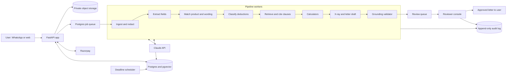

# Prototype and MVP Plan

*Version 1.0, 8 October 2026. Planning start: Monday 12 October 2026. Companion to [HANDOFF.md](HANDOFF.md), which is the source for product facts; this document is the source for scheduling and engineering.*

**Legend.** **[A]** working assumption, to be replaced with data. **[V]** to be verified against a primary source or by counsel. Market evidence lives in HANDOFF.md section 2 and [docs/research](research/README.md) and is not restated here.

## 1. Goals and non-goals

**Goals (by 29 January 2027)**

1. Correctness: every deduction maps to a real clause and every number comes from a tool, measured on a held-out golden set.
2. Willingness to pay: 50+ filed cases, at least 30% fee acceptance, at least 70% of owed success fees collected.
3. Recovery: at least 25% full or partial reversal at the insurer stage within 30 days.
4. Economics: reviewer time under 20 minutes per case; acquisition cost under 30% of expected fee.
5. A continue, pivot or stop decision on 29 January 2027, with a memo.

**Non-goals:** selling or comparing policies; money from insurers, brokers or hospitals; client money; autonomous filing; legal advice; group policies; hospital-bill audit; US claims; fine-tuning; insurer APIs or Bima Sugam; scale beyond roughly 100 live cases.

## 2. Definitions

| Term | Meaning | Customers and money |
|---|---|---|
| **Prototype** (M1) | Concierge service plus a working Claim X-ray pipeline and eval harness on real documents; no customer app beyond a consent-first upload page and WhatsApp Business. | 10-20 hand-held cases; token fee once the entity can collect |
| **MVP** (M2) | Automated intake, analysis, drafting, review console, tracking and payments; a human approves every letter. | Live cases in shadow mode, then paid |
| **Pilot** (M3) | The MVP run on 50-100 live cases across three channels, ending in a decision memo. | Public, limited by lead flow |

## 3. Timeline

Team **[A]**: a product/go-to-market lead and a full-stack/AI engineer, both full-time; a part-time ex-TPA or insurer claims specialist (8-10 hours a week); external counsel; part-time ops from 16 November. One person alone cannot hit these dates (M1 and M2 would each slip about two weeks).

| Milestone | Window | Due | Exit in one line |
|---|---|---|---|
| **M0 Discovery & legal** | Weeks 1-2 | Fri 23 Oct 2026 | 30 interviews, 20+ would pay, no legal blocker for concierge |
| **M1 Prototype** | Weeks 1-3 | Fri 30 Oct 2026 | X-ray on real documents, eval harness, 5 cases filed |
| **M2 MVP** | Weeks 4-9 | Fri 11 Dec 2026 | End-to-end flow, release gates passed, legal gates closed |
| **M3 Pilot & decision** | Weeks 10-16 | Fri 29 Jan 2027 | 50-100 cases, metrics, decision memo |

This is 16 weeks, three more than HANDOFF.md section 10, to build the full MVP before the pilot and let the 30-day insurer window close before the decision. Concierge cases start in week 2.

| Wk | Dates | Focus and deliverables |
|---|---|---|
| 1 | 12-16 Oct | Engage counsel and specialist; file incorporation; apply for WhatsApp verification; interviews begin (15); repo, CI; draft consent notice; fetch four wordings |
| 2 | 19-23 Oct | 30 interviews done; preliminary counsel view; upload page and WhatsApp number live; 25+ consented files; taxonomy; extraction started; first concierge cases (free until payments exist). **M0 gate Fri 23.** Dussehra about 20 Oct **[V]** |
| 3 | 26-30 Oct | Corpus v0 (4 products), calculators v0, X-ray v0, eval harness v0, golden set v0 (40 files, about 100 deductions); token fees start when payment account is live. **M1 demo and gate Fri 30** |
| 4 | 2-6 Nov | Schema, auth, job queue, orchestrator, audit log; BSP fallback decided if WhatsApp verification lags |
| 5 | 9-13 Nov | WhatsApp state machine; web case page; letter templates (insurer, Bima Bharosa, Ombudsman). Diwali about 8 Nov **[V]**. **Written legal opinion due Fri 13** |
| 6 | 16-20 Nov | Reviewer console v1; corpus to 8-10 products; 100 files, annotation complete Fri 20; ops person starts |
| 7 | 23-27 Nov | Grounding validator; end-to-end letters; deadline tracker; consent and deletion flows; Razorpay links; golden set v1 signed off Fri 27 |
| 8 | 30 Nov-4 Dec | Payments end to end; Hindi voice (P1); security hardening, breach runbook; full eval as CI gate; shadow mode on live cases |
| 9 | 7-11 Dec | Bug bash, release candidate, legal-gate review. **M2 gate Fri 11; tag `v0.1.0`** |
| 10 | 14-18 Dec | Pilot opens; landing pages (EN/HI); first partners; every letter reviewed |
| 11 | 21-25 Dec | **Cohort cut-off Mon 21 Dec**: 50 filed, so the 30-day window closes by 20 Jan. Holiday-reduced |
| 12 | 28 Dec-1 Jan | Monitoring; first escalations (cases filed mid-November). Holiday-reduced |
| 13 | 4-8 Jan | Partner and HR-team tests; weekly metrics review |
| 14 | 11-15 Jan | CAC by channel; fee collection; escalation filings for unresolved cases |
| 15 | 18-22 Jan | Cohort window closes; **data freeze Fri 22** |
| 16 | 25-29 Jan | Unit economics on actuals; memo draft Mon 25, review Wed 27, **decision Fri 29** |

Cumulative filed-case targets **[A]**: 5 by 30 Oct; 12 by 13 Nov; 22 by 27 Nov; 35 by 11 Dec; 50 by 21 Dec; 80 by 22 Jan (plan range 50-100).

**Funnel arithmetic (calculation, not data).** At threshold rates (40% of qualified leads upload; 30% of those accept terms), 50 filed cases need about 50 / (0.40 x 0.30), roughly 420, qualified leads in nine weeks: the largest schedule risk. If fewer than 50 cases have matured by 22 January, the memo gives a provisional verdict and proposes a time-boxed extension.

## 4. Prototype specification (M1)

**Scope.** Four retail products across Star Health, Care and Niva Bupa (the most FY25 Ombudsman health complaints: 12,186; 4,423; 3,983). Documents: policy wording and schedule, settlement or rejection letter, discharge summary, itemised bill. Handled end to end: room-rent proportionate deduction, co-pay, sub-limit, non-payable items. Waiting period and pre-existing disease are classified, cited and date-checked but routed to a human for the argument. English documents only.

| Step | M1 | Manual or automated |
|---|---|---|
| Leads, WhatsApp conversation | Dedicated Business number | Manual |
| Consent and upload | Reviewed text, private storage | Automated |
| Product and wording version | Pipeline proposes, human confirms | Hybrid |
| Extract, classify, cite, calculate | Claim X-ray pipeline | **Automated** |
| X-ray delivery; insurer letter | Team reviews and sends; letter model-assisted | Manual |
| Submission, tracking, payment | User's own login and OTP; case table; payment link | Manual |
| Evaluation | `make eval` on golden set v0 | **Automated** |

**Demo script (12 minutes, Fri 30 October).**

1. A real consented case is uploaded; extracted fields show page references and confidence.
2. Claim X-ray: each deduction with clause quote and page, calculator trace (for example the room-rent ratio), recoverable range, route, deadline.
3. A deduction marked "likely valid, do not contest": the product will not charge for unwinnable items.
4. Failure handling: unknown wording version flagged for a human; "guarantee I will get the money" refused.
5. Eval report on golden set v0, including the hard-fail check for invented clauses.
6. Concierge tracker: received, filed, paid.

**Success criteria (all required).**

- Runs end to end on 20+ real consented document sets without developer intervention.
- On the dev split: clause-citation precision at least 90%; **zero invented clauses**; class accuracy at least 80%; amounts within ±2% on at least 90% of deductions **[A: looser than release gates]**.
- Median upload-to-X-ray under 10 minutes.
- 10+ concierge cases received, 5 filed, 2 paying the token fee.
- Eval reproducible from a clean checkout; results stored without customer data.

## 5. MVP specification (M2)

| ID | Pri | Story | Acceptance criteria |
|---|---|---|---|
| US-01 | P0 | Claimant or caregiver submits documents by WhatsApp or web | Itemised consent stored with text version; caregiver uploads policyholder authorisation; nothing processed before consent |
| US-02 | P0 | Receives a Claim X-ray | Per deduction: class, clause quote, amount, contestable or likely-valid, route, deadline; p90 under 5 minutes; held for a human, with notice, if version unknown or confidence low |
| US-03 | P0 | Told which deductions look valid | Listed with reason; excluded from fee base |
| US-04 | P0 | Accepts terms, pays upfront fee | Terms state fees and "no guaranteed outcome"; webhook confirms payment before drafting |
| US-05 | P0 | Gets reviewed letter and submission walkthrough | Released only after approval; user records acknowledgement number |
| US-06 | P0 | Sees timeline and next deadline | Every event dated; deadline from tool |
| US-07 | P0 | Reminded; offered escalation after 30 days | Reminders day 20 and 28 **[A]**; Bima Bharosa and Ombudsman drafts reviewed |
| US-08 | P0 | Reviewer approves, edits or rejects | Evidence side by side; approval blocked while validator fails; edit reason mandatory |
| US-09 | P0 | Specialist maintains corpus and rules | New version segmented, spot-checked, dated; old versions kept |
| US-10 | P0 | User withdraws consent and deletes data | One action; content removed within 7 days **[A]**; confirmation sent |
| US-11 | P0 | Admin reconstructs any output | Passages, tool calls, model and prompt versions, edits retrievable |
| US-12 | P1 | Hindi voice notes | Transcript confirmed by user before use |
| US-13 | P1 | Success fee by UPI link or e-mandate | Link on confirmed recovery; e-mandate only after G6 |
| US-14 | P1 | Partner tracked link | Cases carry `channel`, `partner_id`; partner sees counts, never content |
| US-15 | P1 | Lead sees funnel and CAC by channel | Funnel counts per channel |

**Flows.** Customer: landing (EN/HI), consent and upload, status, X-ray with fee terms, payment, reviewed letter and walkthrough, acknowledgement entry, timeline, outcome and fee. WhatsApp mirrors this as a fixed state machine (menu, media, status, "talk to a human"), not a free-form chatbot; out-of-window messages use approved templates. Reviewer console: queue by age; case view with documents, deductions, calculation trace, letter editor and validator result. Admin: corpus manager, rules library, deadline board, payments ledger, audit viewer.

## 6. Technical design

### 6.1 Architecture



### 6.2 Stack

| Layer | Choice and reason |
|---|---|
| App | **Python 3.12 and FastAPI**, with Jinja2 and HTMX for the console and case pages. One language for pipeline, calculators, evals and UI suits 1-3 people; the console is forms and tables. Revisit if interactivity becomes the bottleneck (ADR-008). |
| Data | **Postgres with pgvector on Supabase, Mumbai** **[V]**: backups, row-level security, storage, auth; health data stays in India. |
| Queue | Postgres-backed (Procrastinate); no extra infrastructure. |
| Model | **Claude API**: mid-tier for analysis and drafting, small model for classification, document input for OCR, schema-constrained outputs. Model IDs pinned, never floating aliases. No fine-tuning (ADR-002). |
| Retrieval | Postgres full-text plus pgvector, rank-fused; reranker only if recall@5 is under 90% **[A]**. Embedder chosen in week 4 on 50 labelled queries; the corpus is public text. |
| Messaging | WhatsApp Cloud API; Indian BSP (Gupshup, Interakt) if verification lags. |
| Payments | **Razorpay** payment links for upfront fee and success-fee invoices; UPI AutoPay as P1. |
| Other | Static Astro site for SEO pages; Sarvam speech-to-text (about ₹30 per audio hour, [pricing](https://docs.sarvam.ai/api-reference-docs/getting-started/pricing)), P1. |
| Hosting | Docker on an India region (Fly.io `bom` or AWS `ap-south-1`) **[V]**; logs never hold document text. |

### 6.3 Data model

- **People and consent:** `persons` (role, hashed phone, encrypted contact); `consents` (purpose, text version, granted, withdrawn); `authorisations` (policyholder, representative, document).
- **Cases:** `cases` (insurer, product, wording version, status, channel, partner, claimed and paid amounts); `documents` (type, storage key, hash, extraction JSON); `filings`; `deadlines` (due, rule, reminder state); `outcomes` (stage, result, recovered amount); `payments`.
- **Corpus:** `insurers`, `products`, `wording_versions` (effective dates, source URL, hash); `clauses` (reference, text, page, embedding); `rules` (source, text, effective dates, parameters).
- **Analysis:** `deductions` (class, amounts, clause, verdict, confidence, calculation trace); `analyses` (recoverable range, route, model and prompt versions, validator result); `letters` and `letter_versions` (body, author, edit reasons, approver).
- **Control:** `audit_log` (timestamp, actor, case, event, payload reference, previous hash, row hash).

### 6.4 Deterministic calculators

Pure functions; parameters come from the matched wording or `rules`; each returns a result and a readable trace; each has unit and property tests. The model never does arithmetic.

- `compute_proportionate_deduction`: eligible over actual room rent, applied to the charge categories the wording names; ICU variant.
- `apply_copay`, `apply_sublimit`: order of application read from the wording.
- `check_waiting_period`: inception, continuity and portability dates against waiting-period and moratorium clauses (statutory parameters **[V]**).
- `classify_non_payable`: bill lines against the policy's list **[V]**.
- `reconcile_settlement`: claimed minus deductions must equal paid within ₹1; mismatches are flagged.
- `compute_deadlines`: grievance, 30-day escalation and Ombudsman windows from effective-dated rules **[V]**.
- `compute_fee`: upfront fee and success-fee base (recovered amount only); GST per counsel **[V]**.

These feed the tools named in HANDOFF.md section 6.3 (`get_clause`, `search_irdai_rules(as_of)`, `check_waiting_period`, `compute_deadlines`, `draft_letter`).

### 6.5 Retrieval corpus

Wordings for 4 products (M1), then 8-10 (M2) across Star Health, Care, Niva Bupa and Aditya Birla (FY25 Ombudsman complaints 12,186; 4,423; 3,983; 2,354, per [Cafemutual](https://cafemutual.com/news/industry/36635-41-of-health-insurance-complaints-were-resolved-in-favour-of-policyholders-in-fy25)); the IRDAI master circular effective 1 August 2024; Ombudsman rules and the complaint form (Annexure VI-A); circulars on non-payables and grievances **[V]**. Every document keeps effective dates and a file hash; a case is matched to the version in force, and an unknown version blocks automation. Chunking is by clause, keeping numbering and page. Retrieval runs inside the matched wording plus the rules table; wordings are assumed to be 30-60k tokens **[A]**, so full text is the fallback when confidence is low. The specialist owns the rules library; changes are dated rows, never overwrites.

### 6.6 Prompt and agent design

An explicit state machine, not an open agent loop; each step is one bounded, schema-constrained model call.

1. Classify document type (small model). 2. Extract fields with page references and confidence (mid-tier, vision). 3. Classify deductions (small; mid-tier on low confidence). 4. Cite: the model may choose only `clause_id`s from retrieved candidates, and code checks each quote appears verbatim. 5. Calculate: code only. 6. Write: X-ray and letters are templates with model-written reasoning; numbers, dates, names and quotations are placeholders (`{{amount_3}}`) filled by code. 7. **Grounding validator** (code): every numeral and date traces to a tool result or source; every quote matches the corpus; no "guaranteed" or legal-advice language. One regeneration, then block.

Requests for guaranteed outcomes, legal advice or policy recommendations are declined. Instructions inside uploaded documents are treated as data and flagged. Prompt, schema and model-ID hashes are stored on every analysis.

### 6.7 Human review and audit

Every outbound letter is approved by a reviewer through the pilot (ADR-004); cases over ₹1 lakh claimed, or with a pre-existing-disease or non-disclosure ground, also need specialist sign-off **[A]**. Edits carry a reason code (wrong clause, wrong amount, tone, missing fact, other) and become candidate golden-set items. Reviewer SLA: 4 working hours **[A]**.

The audit log is append-only and hash-chained, with insert-only rights for the application role. Prompts, retrieved text and drafts sit in a separate encrypted payload store referenced by hash, so deletion removes content but keeps non-identifying event metadata (retention per counsel **[V]**).

### 6.8 Security and privacy

- Treat every document as health data. TLS; encryption at rest; application-level encryption of names, contacts and policy numbers with KMS keys; private buckets, short-lived signed URLs.
- Before model calls, replace identifiers with tokens that code re-inserts; diagnoses stay. The eval measures whether redaction hurts accuracy.
- Row-level security; reviewers see assigned cases only; production access is break-glass and logged; staff MFA.
- Obtain zero-retention or equivalent model-vendor terms; record default retention in a short impact assessment in M0 **[V]**.
- Itemised consent; separate, default-off consent for anonymised proof content; one-click withdrawal and deletion. Documents deleted 90 days after closure unless kept by the user; backups age out within 30 days **[A]**.
- IT Act SPDI Rules apply now; DPDP duties from about May 2027, so build to that standard now ([regulation_and_rails.md](research/regulation_and_rails.md) Q8). Offshore model processing needs counsel's confirmation.
- Breach runbook with named owners; notification timelines per counsel **[V]**. Verified WhatsApp Business profile, because fake Bima Bharosa sites exist.
- No real customer data in the repository ([CONTRIBUTING.md](../CONTRIBUTING.md)).

## 7. Proposed code layout

```text
src/hcra/
  api/          routers
  console/      templates, HTMX
  pipeline/     ingest, extract, match_product, classify, cite, xray, draft, validate, orchestrator
  calculators/  proportionate, copay, sublimit, waiting_period, deadlines, fees, reconcile
  retrieval/    chunking, index, search
  llm/          client, model config, prompts/, schemas/
  security/     redact, crypto, rbac, consent
  audit/        hash-chained log, payload store
  messaging/    whatsapp client, templates
  payments/     razorpay client, webhooks
  db/           models, migrations
  jobs/         reminders, deadlines, retention sweeper
corpus/         manifests, hashes, fetch scripts
eval/           harness, metrics, adversarial set, synthetic fixtures
tests/          unit, property, integration
site/           landing pages (EN/HI)
infra/          Dockerfile, deploy, backup scripts
```

The golden set lives in access-controlled encrypted storage outside the repository; `eval/` holds only schemas, synthetic fixtures and aggregate results.

## 8. Evaluation plan

**Golden set.** 100 consented, anonymised real files by 20 November (40 by 30 October), plus consented live cases. Per deduction: class, clause (with acceptable alternates), amount, verdict, route. Two annotators label independently; the specialist adjudicates and signs off. Target 200-300 deductions, split 60% development and 40% sealed holdout used only for release gates. A 30-item adversarial set covers guarantee and legal-advice prompts, hidden instructions, unknown products, illegible scans and inconsistent totals. Confirmed reviewer edits join weekly.

| Metric | Release gate |
|---|---|
| Clause-citation precision | at least 95% |
| Invented clauses (ID absent, or quote not verbatim) | **0**, hard fail |
| Amounts within ±2% | at least 95% of deductions **[A: how the gate is applied]** |
| Output numbers not traceable to a tool or source | 0 |
| Deduction-class accuracy | at least 90% **[A]** |
| Required-field extraction (amounts, dates, policy period) | at least 98% **[A]** |
| Likely-valid deductions wrongly marked contestable | at most 10% **[A]** |
| Correct refusals on adversarial set | 100% |
| X-ray latency p90 | under 5 minutes |

The first three gates come from HANDOFF.md section 6.4. At 250 deductions, 96% observed precision carries about a ±2.5-point interval, so near-threshold results are reported with intervals.

**Regression testing.** Every pull request: calculator unit and property tests plus a 25-file smoke eval. Any change to a prompt, schema, model ID, retrieval setting or corpus: full development-split eval against the stored baseline; a drop of over 1 point on any metric, or any invented clause, blocks the merge. Every release candidate: full run including holdout and adversarial set, archived with commit, prompt hashes and model IDs. Model upgrades are releases. In the pilot, monitor reviewer edit rate (below 30% by the 22 January freeze), reviewer minutes (below 20), validator block rate and insurer outcomes.

## 9. Legal and compliance gates

Open questions: HANDOFF.md section 7. Counsel decides each gate; nothing here is legal advice.

| Gate | Blocks | Evidence | Target |
|---|---|---|---|
| **G0** | First real customer document | Counsel-reviewed consent and privacy notice; secure upload | 19 Oct |
| **G1** | Taking any payment | Entity and payment account live; terms and fee disclosure reviewed; written no-insurer-money, no-sales policy | 26 Oct |
| **G2** | Advertising recoveries | Consent recorded per proof item | 14 Dec |
| **G3** | Pilot launch | Written opinion on Ombudsman representation, Advocates Act, success-fee enforceability: no blocker | 13 Nov |
| **G4** | Pilot launch | Consent, retention, deletion flows live and drilled; AI disclosure shown ("AI drafts, a human reviews, no guaranteed outcome") | 11 Dec |
| **G5** | Pilot launch | Zero-retention vendor terms; breach runbook rehearsed | 11 Dec |
| **G6** | Success-fee e-mandate | Partner confirms e-mandate and pre-debit rules (HANDOFF.md section 7) **[V]**; UPI links until then | before US-13 |
| **G7** | Caregiver cases | Policyholder-authorisation process agreed with counsel | 13 Nov |

If G3 returns a blocker, the pilot pauses and the product is restructured around what counsel permits before public launch.

## 10. Cost estimate

All **[A]**, at ₹90 per US dollar. Live-case model cost uses HANDOFF.md's ₹100 per case; evaluation assumes cached extraction (about ₹40 per file per run); model prices are the unconfirmed list prices in [tech_feasibility.md](research/tech_feasibility.md) section 6.

| Item (₹) | M0+M1 (3 wks) | M2 (6 wks) | M3 (7 wks) |
|---|---|---|---|
| Counsel, incorporation | 1,75,000 | | 50,000 |
| Specialist (₹1,500 per hour) and case review (₹133 per case) | 36,000 | 72,000 | 63,200 |
| Ops/support, part-time | | 20,000 | 35,000 |
| Interview and file incentives | 19,000 | | |
| LLM: live cases, evals, development | 15,000 | 93,000 | 48,000 |
| Infrastructure, WhatsApp, gateway, speech | 8,000 | 26,000 | 37,000 |
| Annotator, corpus, security review, design | | 96,000 | |
| Acquisition (₹700 x 80 filed) and cyber/indemnity cover | | | 1,06,000 |
| **Subtotal** | 2,53,000 | 3,07,000 | 3,39,200 |
| Contingency 15% | 38,000 | 46,000 | 51,000 |
| **Total** | **about 2.9 lakh** | **about 3.5 lakh** | **about 3.9 lakh** |

Non-people cost is about ₹10.3 lakh over 16 weeks. Team time at HANDOFF.md section 8's ₹6 lakh per month (about ₹1.4 lakh per week) adds about ₹22.4 lakh: roughly **₹33 lakh (about $37,000)** all-in. Pilot model spend fits HANDOFF's under-$200-a-month estimate for 70 users; most M2 spend is evaluation.

## 11. Definition of done

| Milestone | Done when |
|---|---|
| **M0** (23 Oct) | 30 interviews synthesised; 20+ would pay; no concierge blocker in counsel's preliminary view; G0 closed; specialist engaged; 25+ consented files; incorporation filed; four wordings acquired |
| **M1** (30 Oct) | Section 4 criteria met; demo delivered; golden set v0 stored securely |
| **M2** (11 Dec) | P0 stories accepted; section 8 gates passed on the sealed holdout; G1-G5 closed; deletion and restore drills passed; reviewer SLA met in shadow mode on 20+ cases; `v0.1.0` tagged |
| **M3** (29 Jan) | Data frozen 22 Jan; all five HANDOFF.md section 11 metrics reported with sample sizes; unit-economics model on actuals; decision memo reviewed |

## 12. Risks to the timeline and dependencies

| Risk | Mitigation and trigger |
|---|---|
| Lead supply short of about 420 qualified leads | Interviews and communities from week 1; weekly lead target; if under 60% of plan at 27 Nov, add partners and extend the pilot up to two weeks |
| Legal opinion late or negative | Commission in week 1; fall back to user-signed drafting only |
| Fewer than 100 consented files by 20 Nov | Free X-ray in exchange for consent; keep a holdout of at least 80 deductions |
| Meta verification or BSP delay | Apply in week 1; web intake is the primary path |
| Specialist unavailable; wordings hard to obtain | Contract two specialists; limit to public wordings and flag unknowns |
| Payment approval slow for a new entity | Incorporate in week 1; free design-partner cases are excluded from willingness-to-pay metrics |
| Festivals and year-end (weeks 2, 5, 11, 12); scope creep; single engineer | Four-day weeks; nothing enters M2 without removing equal scope; weekly walkthroughs and runbooks |

**Dependencies.** Counsel by 12 Oct and specialist by 16 Oct. Model API access and vendor terms by 19 Oct. Entity and payment account by 26 Oct. WhatsApp verification by 13 Nov. Razorpay onboarding by 23 Nov. Consented files: 25 by 23 Oct, 40 by 30 Oct, 100 by 20 Nov. Wordings: 4 by 23 Oct, 8-10 by 20 Nov.

Backlog: [planning/issues.json](../planning/issues.json). Dates and exit criteria: [planning/milestones.md](../planning/milestones.md). Decisions: [DECISIONS.md](DECISIONS.md).
