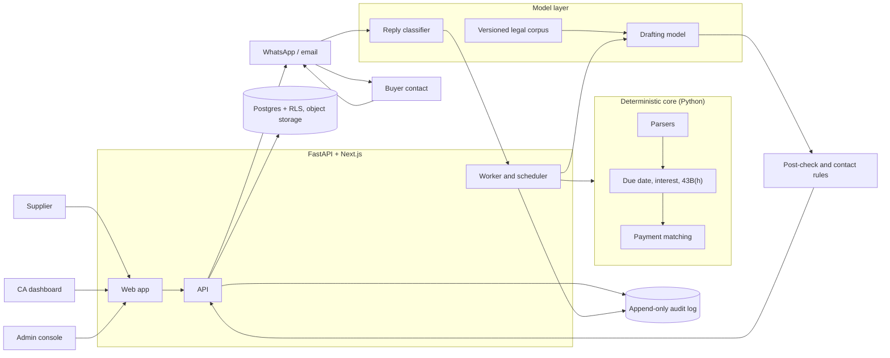

# Prototype and MVP Plan

Draft for ratification at kickoff, Mon 12 Oct 2026 (plan date 8 Oct 2026). Parent: [HANDOFF.md](HANDOFF.md); its wording and flags win. Labels: **Fact**, **Inference**, **Assumption**, **Unverified** (confirm before relying on it).

## 1. Goals and non-goals

**Goals (by 29 Jan 2027)**
1. Show that a deterministic, cited reminder-and-filing engine gets suppliers paid faster against a holdout (HANDOFF target: at least 20% of past-due value paid within 60 days of first reminder).
2. Show that CAs distribute and pay for it (at least 15 CAs bring at least 5 suppliers each; at least 30% of design-partner CAs on paid terms).
3. Match a CA-verified golden set at 100% on every date, interest and 43B(h) figure, enforced in CI.
4. Reach a documented continue, pivot or stop decision on the HANDOFF Section 11 thresholds.

**Non-goals**
- Holding or moving money, lending, credit underwriting ([ADR-002](DECISIONS.md)).
- Autonomous portal filing: the supplier files with their own login and OTP.
- Voice calls, direct-to-MSME self-serve, UK/US, Account Aggregator feeds, ERP connectors (HANDOFF P2).
- Legal advice: formal notices and packs are drafts for CA and counsel review.
- Fine-tuning ([ADR-006](DECISIONS.md)).

## 2. Definitions

| Stage | What it is | Who uses it | Data | Automation |
|---|---|---|---|---|
| **Prototype** (M1) | Concierge service plus a thin internal tool; proves value and calculation correctness. Throwaway UI is fine; the calculation core is not. | 3-5 suppliers via 2-3 CAs, run by the team | Real exports under written consent | Mostly manual; calculators, parsers, drafting automated |
| **MVP** (M2) | HANDOFF P0 features, multi-tenant, with approval gates, audit log, three languages, eval gate in CI | Design-partner CAs and suppliers | Real, tenant-isolated | Campaigns automated after approval; ops handles exceptions |
| **Pilot** (M3) | The MVP run for a decision: holdout, outcome logging, fee collection | Target about 100 suppliers via about 15 CAs; floor of 40 via 8 CAs (Assumption) | Real | As MVP |

## 3. Timeline

Assumes a dedicated team of 1-3 from Mon 12 Oct 2026 (Assumption: product and CA-channel lead, full-stack engineer, part-time engineer or ops; practising CA reviewer on retainer; external counsel). A one-person team keeps the dates, drops P1 items and caps the pilot at about 30 suppliers.

| Milestone | Window | Due | One-line outcome |
|---|---|---|---|
| M0 Discovery & legal | Weeks 1-2 | Fri 23 Oct 2026 | CAs committed; legal opinion commissioned; rule specification written |
| M1 Prototype | Weeks 1-3 (build overlaps M0) | Fri 30 Oct 2026 | Concierge collections live for 3-5 suppliers; dashboard, interest calculator, eval harness working |
| M2 MVP | Weeks 4-9 | Fri 11 Dec 2026 | HANDOFF P0 features live for design-partner CAs; 300-case golden set at 100% |
| M3 Pilot & decision | Weeks 10-16 | Fri 29 Jan 2027 | Outcome data and a continue/pivot/stop memo |

**Note (Inference).** HANDOFF Section 10 runs 13 weeks; this plan runs 16 because it adds a 3-week prototype first. The 60-day recovery metric is readable only for invoices first reminded by 30 Nov 2026 (30 Nov + 60 days = 29 Jan). Later cohorts are read at 30 days and labelled interim. The holdout is a delayed-start group: matched invoices get their first reminder 30 days later (Assumption), so no supplier is denied the service.

### Week by week

| Wk | Dates (Mon-Fri) | Focus | Deliverables |
|---|---|---|---|
| 1 | 12-16 Oct | M0 | Kickoff; ratify metrics and ADRs; brief counsel on HANDOFF Section 7 questions; outreach to 25 CAs; repo and CI; rule spec v0; WhatsApp verification started |
| 2 | 19-23 Oct | M0, M1 build | At least 12 CAs committed (HANDOFF gate); 25 supplier and 15 CA interviews done; 2-3 prototype CAs signed; 3-5 suppliers' exports received under consent; engine v0 and golden set v0 under way |
| 3 | 26-30 Oct | M1 | Dashboard on real exports; English and Hindi templates; first approved reminders; filing pack v0; demo and go/no-go Fri 30 Oct |
| 4 | 2-6 Nov | M2 | Schema, auth, row-level security; ingestion service; engine v1 with versioned rules |
| 5 | 9-13 Nov | M2 | Payment matching; golden set at 150 cases. Diwali is about 8 Nov (Assumption: check calendar); expect slow replies |
| 6 | 16-20 Nov | M2 | Reminder engine, cadence, contact rules; golden set at 300 with CA sign-off; 100 anonymised ledgers collected |
| 7 | 23-27 Nov | M2 | WhatsApp and email sending, opt-out; reply classifier; CA dashboard v1; MVP-flow campaigns for prototype suppliers (30 Nov cohort) |
| 8 | 30 Nov-4 Dec | M2 | Review console; filing pack v1; audit log; regional templates; 200-letter grading |
| 9 | 7-11 Dec | M2 | Hardening; security checklist; full eval run; release Fri 11 Dec |
| 10-12 | 14 Dec-1 Jan | M3 | Pilot launch with holdout; onboarding; weekly outcome review; holiday slack; 60-day reads for the 28-30 Oct cohort |
| 13 | 4-8 Jan | M3 | First success-fee invoices; three real filings supported |
| 14 | 11-15 Jan | M3 | Onboarding closes Fri 15 Jan, leaving 30 days before the memo (Assumption) |
| 15 | 18-22 Jan | M3 | 60-day reads for the 30 Nov cohort; unit economics on actuals |
| 16 | 25-29 Jan | M3 | Decision memo and read-out Fri 29 Jan |

## 4. Prototype specification (M1, by Fri 30 Oct 2026)

**Scope.** Real receivables for 3-5 suppliers through 2-3 CA partners. Supplier approval (and CA approval for formal wording) precedes anything a buyer sees.

| Step | Prototype handling |
|---|---|
| Intake | CA or supplier emails a Tally, Excel or CSV debtors export; consent signed first |
| Ingest and match | **Automated** parser; **manual** fixing of rejected rows and bank-credit matching |
| Due date, interest, 43B(h) | **Automated** engine v0, no model involvement |
| Drafting | **Automated**: template plus model personalisation; English and Hindi |
| Approval and send | **Manual**: supplier approves; ops sends from the supplier's own account or a shared mailbox (no WhatsApp API) |
| Replies | **Manual** triage; classifier run offline |
| Filing pack | **Automated** PDF v0; CA reviews; supplier files |
| Buyer score, TReDS | **Manual** days-to-pay table; TReDS eligibility noted only |

**Demo script (10 minutes).**
1. Upload a real client debtors export (with consent); show parsed rows and rejects.
2. Dashboard: total overdue, 43B(h) exposure at 31 Mar 2027, accrued interest by buyer.
3. Open one invoice: due-date and interest working, rate-table version, rule citation.
4. Generate a Hindi day-46 notice; click any number to see its tool output.
5. Approve and send; paste a reply ("will pay by the 20th"); show classification and the pause.
6. Show the filing pack PDF and correspondence log, then the eval report.

**Success criteria.**
- 3-5 suppliers live through at least 2 CAs; at least ₹1 crore past-due loaded (Assumption).
- Engine v0 matches a 60-case CA-signed golden set at 100%.
- At least 90% of export rows parse without manual fix (Assumption).
- At least 20 approved reminders sent; zero containing a figure not in tool output.
- One filing pack reviewed by a CA with a written defect list.
- At least 2 of 3 prototype CAs say they would pay (stated intent only).

## 5. MVP specification (M2, by Fri 11 Dec 2026)

Roles: Supplier (S), CA (C), Admin (A, the team's ops). Priorities follow HANDOFF Table 4.
### User stories

| ID | Pri | Story | Acceptance criteria |
|---|---|---|---|
| S-1 | P0 | As a supplier I consent and upload my ledger | Consent stored with timestamp and text version; Tally XML, Excel or CSV upload; row-level error report |
| S-2 | P0 | I approve or reject each campaign and protect key buyers | Nothing sent before approval; protected buyers get no automated contact; approvals logged |
| S-3 | P0 | I see what each buyer owes, interest and 43B(h) exposure | Figures equal engine output; as-of date and rule-set version shown |
| S-4 | P0 | I can stop automation for any buyer | Effective within 1 minute; pending drafts cancelled |
| S-5 | P1 | I see buyer replies and promise dates in one place | Replies classified; promise dates create follow-up tasks |
| C-1 | P0 | As a CA I invite suppliers and see all clients on one dashboard | A CA sees only own clients (tested); sortable by exposure and age |
| C-2 | P0 | I approve formal notices before they go | No send without CA approval; edit history kept |
| C-3 | P0 | I generate a filing pack | PDF holds invoices, PO, GRN, IRN where supplied, GST filings, ledger, correspondence log, interest computation; missing items listed |
| C-4 | P0 | I run the free exposure audit on a client ledger | Upload to report in under 5 minutes for 5,000 rows |
| C-5 | P1 | I see recovery and fees per client | Attribution against the holdout shown |
| A-1 | P0 | As admin I review exceptions: unmatched payments, parse rejects, disputes | Queue with owner and age; resolved with a reason code |
| A-2 | P0 | I manage rate tables and rule sets | Versioned by effective date; second-person approval; golden set re-runs |
| A-3 | P0 | I process opt-outs and deletion requests | Opt-out blocks all channels at once; deletion within the documented window |
| A-4 | P1 | I flag TReDS-eligible invoices and refer them | Referral recorded; no money handled |
| A-5 | P1 | Buyers use a response page | Confirm, dispute or promise date without login |

### Core flow

Onboard (CA invites; supplier consents; Udyam number, contacts and tone captured; key accounts protected) -> ingest (parse, dedupe, reconcile, exposure report) -> campaign (cadence proposed, drafts rendered, supplier approves, scheduler sends within contact rules) -> listen (replies classified; pause on dispute, opt-out or promise date) -> escalate (CA reviews notice; pack built; supplier files; outcome recorded).

## 6. Technical design

### 6.1 Architecture



### 6.2 Recommended stack (Inference)

| Layer | Choice | Why |
|---|---|---|
| Core logic | Python 3.12, `Decimal`, pytest | Exact money maths; easy parsing and eval harness; one package serves prototype and MVP |
| API and worker | FastAPI; Postgres-backed job queue and scheduled jobs | One datastore for a 1-3 person team |
| Web | Next.js (TypeScript) for dashboard, review console and buyer page; **Streamlit for the M1 prototype only** | Streamlit ships a dashboard on the core package in days and is deleted after M2; a Python-only team can use server-rendered FastAPI instead (decide in M0) |
| Data | Postgres on Supabase with row-level security, object storage, pgvector (HANDOFF Section 6) | Tenant isolation without custom code. India-region availability: Unverified |
| Models | Claude API: mid-tier model for drafting, small model for reply classification; IDs in config | Matches HANDOFF; classification is high-volume and cheap. No fine-tuning |
| Retrieval | Hybrid keyword plus embeddings over a small versioned corpus (MSMED Act, amendment, Section 43B(h), Samadhaan procedure) | Small corpus; effective date stored on each document |
| Messaging | Prototype: manual send. MVP: WhatsApp Cloud API or a BSP (Gupshup, Interakt), decided in M0; email via a transactional provider (for example SES) | WhatsApp template and opt-in rules unverified; email must work alone |
| GST, e-invoice, Tally | Uploaded exports and Tally XML/Excel in the MVP; GST API via a licensed GSP/ASP later (Unverified); live Tally connector is P1 | Avoids licence delay and any dependence on Tally, whose TallyIra is a competitor |
| PDF | HTML-to-PDF with embedded Noto Devanagari and regional fonts | Hindi notices must render correctly |

### 6.3 Data model (core tables)

`tenants` (CA firm), `users`, `suppliers`, `buyers`, `buyer_contacts` (named staff, channel, opt-out), `ingestion_batches`, `invoices` (acceptance date, amount, GST split, agreement flag, credit days, IRN, status), `payments`, `payment_allocations`, `rate_tables` (RBI bank rate, effective date, source URL), `rule_sets` (version, parameters, legal-confirmation status), `campaigns`, `campaign_steps`, `messages` (template ID, language, slots), `message_events`, `replies`, `classifications`, `consents`, `approvals`, `filing_packs`, `treds_referrals`, `audit_log`.

Every table carries `tenant_id` for row-level security; amounts are integer paise.

### 6.4 Deterministic calculators

Three pure functions own every number. They take a `rule_set` version and return a result plus a trace (inputs, rule IDs, rate rows used).

- `compute_due_date`: acceptance date plus agreed credit days when a written agreement exists, else 15 days. 43B(h) limit L = 45 days with an agreement, 15 without (HANDOFF Section 2). Deemed acceptance (15 days after delivery if the buyer raises no objection) is **Unverified**; counsel to confirm.
- `compute_interest`: interest on the unpaid amount from the day after the due date to the as-of or payment date. Rate: three times the RBI bank rate, compounded with monthly rests (**Unverified** background knowledge; counsel to confirm). Parameters `multiplier`, `compounding`, `day_count` and `payment_allocation_order` live in the rule set, so a legal answer changes data, not code. Defaults (Assumption): actual/365, interest settled before principal, rounding half-up to paise at each monthly rest. The rate table is versioned by effective date and sourced from RBI notifications.
- `compute_43bh_exposure`: at a financial-year end, sums invoices unpaid beyond L or paid after L, as deduction at risk. It reports the deduction amount, not a tax figure. Whether the GST component is included and how a later payment before the return due date is treated are **Unverified**; CA to confirm.

### 6.5 Messages, ladder and conduct

**Drafting design.** Each step has a reviewed template per language with named slots (`{principal}`, `{due_date}`, `{interest_accrued}`, `{interest_as_of}`, `{limit_date_43bh}`). The model personalises phrasing around slots; the renderer fills them from tool output. The post-check blocks any message containing a numeral, date or legal citation outside the slot values and the approved citation list, or any banned phrase (threats, false legal claims). Failures are logged and never sent.

**Default escalation ladder (Assumption, HANDOFF Section 5).** Days count from the acceptance date A for the standard 45-day case; other terms re-anchor to the due date D and the 15/45-day limit in config. HANDOFF does not say what anchors "day-30"; this plan uses A and confirms it in M0 interviews.

| Step | Timing | Content | Approval |
|---|---|---|---|
| 1 Heads-up | A+30 | Friendly note; confirm/dispute/promise-date link | Campaign approved once by supplier |
| 2 Pre-due courtesy | D-3 | Invoice reference and due date | Same |
| 3 Due-date nudge | D | Same, plus statement offer | Same |
| 4 43B(h) and interest notice | A+46 | Cites 43B(h) and interest accrued, as computed | Supplier approves each wording |
| 5 Finance-head statement | A+52 | One consolidated statement to the finance head | Supplier approves |
| 6 Formal notice | A+60 | Legal wording | **CA review required** |
| 7 Filing pack | A+60 to A+75 | Pack for the supplier to file | CA review; supplier files |

Protected buyers skip steps 1-3. A dispute, opt-out or promise date pauses the ladder until a human resumes it. Letters cite only confirmed provisions, excluding the amendment until assent and commencement are confirmed (HANDOFF Section 12).

**Contact rules, enforced in code (HANDOFF Section 7).** 8am-9pm only; at most 7 contacts per 7 days per contact (Assumption); named AP, finance or tax staff only; no threats or false legal claims; AI-assistance and on-behalf-of disclosure; opt-out honoured at once; pause on dispute.

**Consent.** Supplier consent (purpose, data, contacts, retention) is recorded before any upload. The lawful basis for messaging a buyer's named employee is an open legal question (HANDOFF Section 7); until counsel answers, the first message carries a notice and an opt-out.

### 6.6 Audit log

Append-only table written by the API and worker only; the application role has no UPDATE or DELETE grant. Each row stores inputs, retrieved document versions, tool-call traces, model name and version, draft and final text, approver and delivery receipts, plus the previous row's hash (Inference). The latest hash is exported daily to write-once storage; a CI script verifies the chain.

### 6.7 Security and privacy

- Encryption in transit and at rest; row-level tenant isolation with an automated cross-tenant test; role-based access; secrets in a managed store; no customer data in the repository ([CONTRIBUTING.md](../CONTRIBUTING.md)).
- Names, phone numbers, GSTIN and emails are tokenised before any model call; buyer replies are untrusted text, classified and never executed. Vendor no-training terms; counsel reviews offshore processing.
- DPDP: rules notified Nov 2025, most duties from about May 2027, IT Act SPDI Rules meanwhile (HANDOFF Section 7). Build notice, lawful basis, retention, deletion and a breach runbook now; supplier as fiduciary, product as processor (Inference).

## 7. Proposed code layout

```
msme-receivables-agent/
├── apps/
│   ├── api/                  # FastAPI routes, auth, webhooks
│   ├── web/                  # Next.js: CA dashboard, review console, buyer page
│   └── prototype/            # Streamlit (M1 only; removed after M2)
├── packages/core/            # pure Python, no web framework
│   ├── calc/                 # due_date.py, interest.py, exposure.py, rates.py
│   ├── ingest/               # Tally XML, Excel/CSV, e-invoice JSON, bank CSV
│   ├── match/  scoring/      # payment matching; buyer score
│   ├── agent/                # cadence, drafting, classify, postcheck
│   ├── packs/                # filing-pack builder, PDF templates
│   └── rules/                # versioned rule sets, rate tables (YAML)
├── templates/                # reviewed message templates: en/, hi/, <regional>/
├── corpus/                   # versioned legal text with source URLs and effective dates
├── evals/
│   ├── golden/  ledgers/     # synthetic or anonymised only
│   ├── letters/  replies/    # grading sheets; labelled buyer replies
│   └── thresholds.yaml, run_evals.py
├── db/migrations/
├── infra/
├── scripts/
├── planning/                 # milestones.md, issues.json
└── docs/                     # HANDOFF.md, this plan, DECISIONS.md, research/
```

## 8. Evaluation plan

Suites run in CI on every change touching `packages/core`, `templates`, `corpus` or `evals`; a failing blocking suite fails the build.

| Suite | Size (M1 / M2) | Metric | Threshold | Blocking |
|---|---|---|---|---|
| Date, interest, 43B(h) golden set | 60 / 300 | Exact match to the paisa, CA-signed | 100% | Yes |
| Ledger matching | 20 / 100 anonymised ledgers | Precision / recall | At least 95% / 90% | Yes from M2 |
| Letter quality | 40 / 200 generated letters | Citation precision; invented provisions; tone and language review by native speaker | At least 95%; zero; reviewer edit rate under 30% by week 12 | Citation and invention: yes |
| Post-check | Every golden-set message | Figures not in tool output that reach send | 0 | Yes |
| Reply classification | 150 / 300 labelled replies (English, Hindi, mixed, one regional) | Macro-F1; recall on opt-out; recall on dispute | At least 0.90; at least 99%; at least 97% (Assumption) | Yes from M2 |
| Adversarial replies (prompt injection) | 50 | Replies causing any tool action or policy bypass | 0 | Yes |
| Tenant isolation | Automated | Cross-tenant reads | 0 | Yes |

**Golden set (300 cases):** due date with and without agreement or deemed acceptance, 60; single-period interest, 80; interest across rate changes, 40; partial payments, 50; 43B(h) year boundaries, 40; edge cases (leap years, month ends, same-day payment), 30. A CA computes each case independently; disagreements go to counsel and are recorded in the rule set.

**Regression rule.** Every fixed bug adds a case to its suite; every rule-set change reruns all suites and attaches the report to the pull request.

## 9. Legal and compliance gates

No gate is passed on assumption; counsel's written answers are recorded in [DECISIONS.md](DECISIONS.md).

| Gate | Before | Condition |
|---|---|---|
| G0 | Real data enters the system | Signed supplier consent; data-handling note; storage location decided |
| G1 | First message to a buyer | Conduct policy in code; AI disclosure; supplier approval; counsel's preliminary view on messaging a buyer's named employee |
| G2 | Any letter cites the amendment | Presidential assent and commencement confirmed; until then cite only confirmed provisions |
| G3 | Delivering a formal notice or filing pack | Counsel's view on non-lawyers assembling Council filings; CA sign-off on the template |
| G4 | Charging fees | Counsel reviews terms, success-fee contract and CA agreement; if not done by 30 Oct, M1 runs unpaid. Automated debit also needs RBI e-mandate compliance (24-hour notice; extra authentication above ₹15,000) |
| G5 | Pilot launch | DPDP-aligned notice, retention, deletion and breach runbook in place; no money handled |

## 10. Cost estimate (Assumptions; replace with actuals)

| Item | Basis | Estimate for 12 Oct-29 Jan |
|---|---|---|
| Team and tools | HANDOFF unit-economics assumption of ₹6 lakh a month, about 3.7 months | About ₹22 lakh |
| Legal opinion | Assumption | ₹2-4 lakh |
| CA reviewer retainer | 40-60 hours at ₹2,500 (Assumption) | ₹1-1.5 lakh |
| Language review | Two languages (Assumption) | ₹0.3-0.6 lakh |
| Hosting, LLM, messaging | Hosting ₹3-10k a month; LLM about $1 per supplier a month at ₹90; messaging ₹0.50 each | ₹0.5-1 lakh |
| Contingency | 15% | ₹4-4.5 lakh |
| **Total** | | **About ₹30-34 lakh** |

A smaller team lowers the first line. HANDOFF Section 8 break-even is about 273 suppliers (about 28 CAs) on the base case and about 1,500 on the downside; the pilot tests its inputs (attributable recovery, fee collection, review minutes per case).

## 11. Definition of done

| Milestone | Done when |
|---|---|
| M0 (23 Oct) | At least 12 CAs committed; 25 supplier and 15 CA interviews logged; legal opinion commissioned in writing; rule spec v0 lists every Unverified item; HANDOFF Section 13 decisions answered or assigned; WhatsApp verification started |
| M1 (30 Oct) | Section 4 criteria met; demo given to at least 2 CAs; go/no-go recorded |
| M2 (11 Dec) | All P0 stories pass acceptance criteria; Section 8 blocking suites green; G0-G3 passed; audit chain verified; at least 6 CAs and 15 suppliers onboarded (Assumption); release tagged |
| M3 (29 Jan) | HANDOFF Section 11 metrics computed with the holdout method stated; unit economics on actuals; at least 10 packs generated and 3 filed; decision memo delivered |

## 12. Timeline risks

| Risk | Response |
|---|---|
| CA recruitment slow during late-October tax-audit and ITR season (Assumption) | Outreach from 12 Oct; prototype needs only 2-3 CAs; allow a one-week M0 slip |
| Counsel not back by M1 or M2 | Brief in week 1; parameterised rules; hold notices and fees until cleared |
| WhatsApp verification delayed | Email fallback; manual WhatsApp in M1 |
| Messy real exports | Collect 25 ledgers in M0; reserve a rework week in M2 |
| Amendment assent unknown | Versioned rule sets; cite confirmed provisions only |
| Too short for 60-day reads | Cohort method in Section 3; extend the memo by up to 4 weeks if the floor of 40 suppliers is reached late |

## 13. Dependencies

- Counsel engaged by 16 Oct; a practising CA for the golden set (60 cases by 27 Oct, 300 by 20 Nov).
- 2-3 prototype CAs and 3-5 consenting suppliers.
- WhatsApp verification started in week 1; Anthropic API, Supabase and email accounts.
- Native-speaker reviewers (regional language pending: HANDOFF Section 13); RBI bank-rate history with sources.
