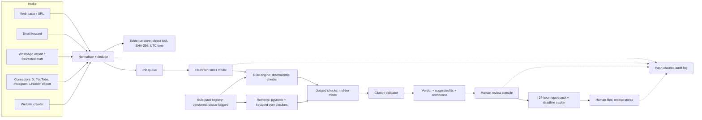

# Prototype and MVP Plan

*Status: planning draft, 8 Oct 2026. Companion to [HANDOFF.md](HANDOFF.md), which holds the market case, pricing and kill criteria. This plan covers a dedicated team of 1 to 3 starting Monday 12 Oct 2026. Tags follow HANDOFF: **[Assumption]** is a planning choice, **[Inference]** is reasoning from sourced facts, **[Unconfirmed]** is a regulatory or platform detail not yet checked against a primary source. Verify every rule against sebi.gov.in before building to it or using it in sales claims.*

## 1. Goals and non-goals

**Goals**

1. Show that a classifier plus a versioned rule checker finds the breaches a compliance owner cares about in real public posts, with recall high enough to serve as a first pass.
2. Show that tamper-evident evidence, a 24-hour report pack and an audit log can be produced automatically.
3. Learn which segment pays, and how much, from design partners.
4. Reach a documented scale, pivot or stop decision by about 29 Jan 2027 using [HANDOFF section 11](HANDOFF.md).

**Non-goals (through the pilot)**

- Posting on a firm's behalf, or recommending securities to investors.
- Certifying compliance. The regulated entity stays solely responsible for AI outputs under the February 2025 amendments ([regulation_and_rails.md, Q4](research/regulation_and_rails.md)).
- Automated filing. A named human files; the filing channel and format are **[Unconfirmed]**.
- Staff-communication surveillance, KYC/AML, call-recording infrastructure, VAPT delivery, mobile app, SSO, branch/AP hierarchy, public API (P2 in HANDOFF).
- Model fine-tuning ([ADR-005](DECISIONS.md)).

## 2. Prototype, MVP and Pilot

| Stage | Purpose | Users and data | Exit question |
|---|---|---|---|
| **Prototype** (M1, ~30 Oct 2026) | Feasibility. Command line plus static report; some steps manual | The team and 3 to 5 reviewers; public posts and synthetic variants only | Does it find real breaches with defensible clause citations? |
| **MVP** (M2, ~11 Dec 2026) | Hosted multi-tenant product a design partner can use weekly | Partner firms under written data-use consent | Can a firm run its posting workflow end to end? |
| **Pilot** (M3, ~29 Jan 2027) | Commercial validation and quality gates | 5+ weekly firms, 10+ paying (HANDOFF target) | Scale, pivot or stop? |

## 3. Timeline

### 3.1 Summary

Team: **PL** product and compliance lead, **ENG** AI/backend engineer, **FS** full-stack and go-to-market (HANDOFF section 10; 1 to 3 people **[Assumption]**).

| Milestone | Weeks | Dates | Headline outcome |
|---|---|---|---|
| M0 Discovery and legal | 1 to 2 | 12 to 23 Oct 2026 | Ad-code status known; 15 interviews; labelled-set collection started; rules corpus v0; legal opinion commissioned |
| M1 Prototype | 3 | 26 to 30 Oct 2026 | Classifier and rule checker on 150 labelled real posts; evidence archive; sample 24-hour report; eval harness |
| M2 MVP | 4 to 9 | 2 Nov to 11 Dec 2026 | Hosted MVP; versioned rule packs; 300+ labelled items |
| M3 Pilot and decision | 10 to 16 | 14 Dec 2026 to 29 Jan 2027 | 5+ weekly firms; pricing tests; 500-item eval; penetration test; decision memo |

**Reconciliation with HANDOFF.** The Phase 1 gate (F1 at least 0.85 on 300+ items, 5 firms onboarded) becomes the **Week 6 checkpoint, 20 Nov**. The day-90 check (5 weekly, 10 paying) is the **Week 13 checkpoint, 8 Jan 2027**. The decision window runs three weeks past day 90 so January conversions count **[Assumption]**. M0 targets 15 interviews (HANDOFF Phase 0 says 20); the other 5 finish by 13 Nov.

### 3.2 Week by week

| Wk | Dates | Work and output |
|---|---|---|
| 1 | 12 to 16 Oct | PL: search sebi.gov.in for the notified ad code and log the result; start the weekly Monday SEBI watch; book interviews; draft labelling guide; brief a securities lawyer. ENG: repo, CI, rule-record schema; spike classification on 20 posts. FS: outreach to RIAs, RAs, consultants; design-partner one-pager and consent form |
| 2 | 19 to 23 Oct | Finish 15 interviews; rules corpus v0 (draft CAC plus in-force circulars); evidence-capture spike; collect public posts; sign 3 partners. **M0 exit** |
| 3 | 26 to 30 Oct | Label to 150 with a second reviewer; classifier, deterministic checker, judged checks with quote validation, eval harness, evidence archive, sample 24-hour report; demo to 3 to 5 reviewers. **M1 exit, Fri 30 Oct** |
| 4 | 2 to 6 Nov | Demo feedback; adjudication; interviews 16 to 20; data model, auth and roles; web paste and URL intake; concierge checks for partners |
| 5 | 9 to 13 Nov | Label to 250; queue worker; email-forward intake; review console v1; buffer for Diwali holidays (dates to be confirmed) |
| 6 | 16 to 20 Nov | Label to 300; rule-pack versioning and status flags; eval in CI; object-lock evidence store; WhatsApp export intake. **Checkpoint 20 Nov** |
| 7 | 23 to 27 Nov | Partner onboarding; legal opinion received (target); 24-hour report pack, deadline clock, hash-chained audit log; CSCRF calendar and template published before 30 Nov |
| 8 | 30 Nov to 4 Dec | AI-use disclosure and suitability generators; register export; terms and DPA to counsel. Feature complete |
| 9 | 7 to 11 Dec | Hardening, 1,000-item load test, regression suite, onboarding flow. **M2 exit, Fri 11 Dec** |
| 10 to 12 | 14 Dec to 1 Jan | Partners on live workflow; weekly check-ins; add rules from partner misses; label to 500; confidence calibration; penetration-test scoping; holiday buffer |
| 13 | 4 to 8 Jan | Pricing tests at ₹20k, ₹35k, ₹50k; pen-test fixes. **Checkpoint 8 Jan (day 90)** |
| 14 to 15 | 11 to 22 Jan | Final eval on 500 items; case studies; 3 consultant partners; paid conversions; decision memo draft |
| 16 | 25 to 29 Jan | Decision memo; handover. **M3 exit, Fri 29 Jan 2027** |

### 3.3 Dependency on the ad code, and contingencies

The SEBI board approved the Common Advertisement Code on 24 Sept 2026. The notified text and effective date are **[Unconfirmed]** and not in the research. The draft proposed a six-month transition ([Mondaq](https://www.mondaq.com/india/fund-management-reits/1826178/sebis-proposal-for-a-common-advertisement-code-financial-advertisements-under-the-regulatory-lens)), which ends around H1 2027 only if notified soon **[Inference]**. Week 1 decides the branch:

| Scenario | Response |
|---|---|
| A. Notified before M1 | Replace draft rules with the notified text in pack v1; log effective date and reporting channel; time pilot messaging to the transition deadline |
| B. Not notified by M2 (base case) | Ship draft-derived rules flagged "advisory, pending notification" ([ADR-003](DECISIONS.md)). Lead with value that does not depend on notification: pre-publication check against in-force finfluencer and IA/RA circulars, evidence archive, AI-use disclosure, CSCRF kit. Do not describe the 24-hour filing as mandatory |
| C. Notified with material changes | Re-map rules, regress across pack versions, re-label affected items; budget 1 to 2 weeks and cut P1 scope first |
| D. Final text drops the 24-hour report, or a free SEBI/exchange tool covers it | Pivot to pre-publication check and audit trail (HANDOFF kill table) |
| E. Portal-only reporting, no API | Keep human filing; the tool prepares the pack and tracks the receipt (already the design) |

### 3.4 If the team is one person

Cut in order: WhatsApp export, disclosure and suitability generators, CSCRF kit, second label reviewer (use one reviewer plus a consultant audit of 20%). Keep classifier, rule checker, evidence archive, 24-hour pack, eval harness, review console. Expect M2 to slip about three weeks **[Assumption]**.

## 4. Prototype specification (M1)

**Scope.** A command-line pipeline and static HTML report. For each labelled item: classification (ad or not; celebrity; entity type; channel), rule findings with clause citations, verdict with confidence, an evidence record, and one sample 24-hour report.

| Step | Prototype |
|---|---|
| Collecting items | Manual: CSV of URLs and pasted text; headless-browser screenshots |
| Hash, timestamp, snapshot | Automated (SHA-256, UTC) |
| Ad / not-ad, celebrity, entity, channel | Automated, small model, structured output |
| Deterministic rules (15 to 25) | Automated from YAML pack v0 |
| Judged rules (implied guarantees, performance claims, advice vs education) | Automated; each finding quotes a clause verified to exist in the corpus |
| Human review | Manual, via spreadsheet export |
| 24-hour report | Template; field list is an assumption because the official format is **[Unconfirmed]**; no filing |
| Labels | Manual: two reviewers, a third adjudicates |

**Rule pack v0.** Sources named in HANDOFF section 6: finfluencer circulars (Aug 2024, Oct 2024, 29 Jan 2025, including the three-month price-data rule for "education"), the 8 Jan 2025 IA/RA circulars (AI-use disclosure), the February 2025 AI-liability amendments, and the draft CAC (advisory). Candidate deterministic checks: missing registration number or disclaimer, return or performance claims, banned phrases, celebrity follower threshold (more than 500,000 in the draft), recent prices in education content, the 24-hour clock. Exact content is **[Unconfirmed until read from the circulars]**.

**Labelled set (150).** Mix **[Assumption]**: 90 real public posts from registered RIAs, RAs, PMS managers, brokers and MFDs on X, LinkedIn, YouTube and Instagram; 40 synthetic variants for rare breaches; 20 clear non-ads (research reports, explainers). Items stay in a private store, never in git ([CONTRIBUTING.md](../CONTRIBUTING.md)). Collection is manual and low-volume; platform terms on scraping are **[Unconfirmed]**.

**Demo script (10 minutes, compliance professional).**

1. Paste a real public post; show classification, quoted clause and suggested fix.
2. Show a near-miss educational post correctly left alone, and why.
3. Open the evidence record: hash, UTC time, screenshot, rule-pack version.
4. Generate the sample 24-hour report; point out the "format unconfirmed" label.
5. Show per-rule recall and precision, and the misses.
6. Ask what they would need to see before using it on real posts.

**Success criteria** (baseline, not commercial gates):

| Criterion | Target |
|---|---|
| Ad / not-ad F1 on 150 items | At least 0.80 |
| High-severity recall | At least 85%, every miss analysed |
| Citation validity (quote exists in corpus) | 100% by construction; relevance precision at least 90% on 50 findings |
| Run time per item | Under 60 seconds |
| Reviewer verdict | 3 of 5 call it "worth a first pass" |
| Evidence | Recomputed hash matches for 100% of items |

## 5. MVP specification (M2)

### 5.1 User stories

| ID | Pri | Persona | Story |
|---|---|---|---|
| S1 | P0 | Solo RIA/RA | Paste a draft; see whether it is an ad and what it breaches, with the clause quoted, before publishing |
| S2 | P0 | Solo RIA/RA | Forward a WhatsApp broadcast draft or upload an export and get the same check |
| S3 | P0 | Solo RIA/RA | After publishing, paste the URL so the as-published version is captured |
| S4 | P0 | Solo RIA/RA | See a 24-hour countdown per published item and a ready report pack to review and file |
| S5 | P1 | Solo RIA/RA | Generate an AI-use disclosure for agreement, website and report footers |
| S6 | P1 | Solo RIA/RA | Get a suitability rationale draft that I edit and approve |
| S7 | P1 | Solo RIA/RA | Export a monthly ad register and audit pack |
| C1 | P0 | Compliance officer | Review a severity-sorted queue; approve, edit or reject; decision logged |
| C2 | P0 | Compliance officer | See which rule-pack version produced each finding and whether it is in force or advisory |
| C3 | P0 | Compliance officer | Show an auditor the hash, timestamp, original, as-published capture, reviewer and filing receipt for any item |
| C4 | P1 | Compliance officer | Filter the register by channel, author, verdict and overridden findings |
| C5 | P1 | Compliance officer | Mark a false positive with a reason that feeds the eval backlog |
| A1 | P0 | Admin | Invite users and assign roles (author, reviewer, admin) |
| A2 | P0 | Admin | Register channels and intake methods |
| A3 | P0 | Admin | Set retention; evidence cannot be altered or deleted before it ends |
| A4 | P1 | Admin | Download the activity log; manage consent for evaluation use |
| A5 | P1 | Admin | See CSCRF deadlines (including 30 Nov 2026) and mark templates complete |

### 5.2 Screens

Sign-in and firm onboarding; inbox (draft, flagged, approved, published, reported); check result; review console; report pack with countdown and receipt upload; evidence viewer; register and exports; disclosure and suitability generators; admin (users, channels, retention, rule-pack status); CSCRF-lite calendar and templates.

### 5.3 Acceptance criteria

- A new user completes paste, check, approve, mark published, receive report pack in under 10 minutes unaided.
- Every finding shows a quote that the validator confirmed exists in the cited source.
- Every item has an immutable evidence record; a nightly job recomputes hashes and alerts on mismatch.
- Every state change writes a hash-chained audit entry; chain verification passes.
- Findings store the rule-pack version; activating a new pack never rewrites history.
- Tenant isolation test: firm A cannot read firm B's items through API, storage or database.
- CI eval gates pass on the 300-item set (section 8).
- Nothing is auto-filed or auto-published.

## 6. Technical design

### 6.1 Architecture



### 6.2 Stack and justification

| Layer | Choice | Why |
|---|---|---|
| Language, capture | TypeScript for web, worker and eval harness; Playwright for HTML and screenshots | One language for a small team; the rule engine runs identically in app and CI |
| Web | Next.js (App Router) | Fast auth, forms and dashboards; keys stay server-side |
| Database | Postgres with pgvector on Supabase, India region if available **[Assumption]** | Suggested in HANDOFF; row-level security for tenancy; relational, vector and full-text in one system |
| Queue | pg-boss on Postgres | No extra infrastructure at pilot scale **[Assumption]** |
| Evidence store | S3-compatible storage with Object Lock (compliance mode), Mumbai region **[Assumption]** | Write-once retention (HANDOFF section 6); Supabase Storage lacks object lock |
| Classification | Claude API, small model, structured JSON output | Cheap first pass; HANDOFF specifies a small model |
| Judged checks, drafting | Claude API, mid-tier model | Explanations, disclosures, suitability drafts |
| Model governance | Pinned model IDs; zero-retention terms confirmed before partner data is sent **[Assumption]** | Reproducible evals; HANDOFF security |
| WhatsApp | Export upload and forwarded drafts first; Cloud API or an Indian BSP (Gupshup, Interakt) later | Avoids approval delays in the first 9 weeks |
| CI | GitHub Actions; secrets in the platform vault | Minimal ops |

**Connectors.** Platform terms and costs for X, LinkedIn, YouTube and Instagram are **[Unconfirmed]**. P0 intake needs no platform API (paste, URL, email forward, WhatsApp export). YouTube Data API and Instagram Graph API (user-authorised business accounts) are P1. LinkedIn is paste or user-supplied export. X depends on API terms, checked in M0. The website crawler covers a firm's own domains only.

### 6.3 Data model

| Table | Key fields |
|---|---|
| `firms`, `users`, `memberships` | entity_type (RIA, RA, PMS, broker, MFD), registration_no, retention_days, role |
| `channels` | firm_id, kind (x, linkedin, youtube, instagram, website, whatsapp_broadcast, email), handle_or_url |
| `items` | state, author, published_at, deadline_at, content_hash |
| `captures` | kind (draft, as_published), object_key, sha256, captured_at_utc |
| `classifications` | is_ad, is_celebrity, entity_type, confidence, model_id, prompt_version |
| `rule_packs`, `rules` | version, status (draft, advisory_pending_notification, in_force, superseded), effective_from; rule citation, trigger, check_type, severity |
| `findings` | rule_id, pack_version, verdict, quoted_clause, clause_ref, explanation, confidence |
| `reviews`, `reports`, `disclosures`, `suitability_drafts` | decision, edits; due_at, pack_object_key, filed_by, receipt_object_key; content, approved_by |
| `audit_log` | seq, ts_utc, actor, action, payload_hash, prev_hash, entry_hash |
| `labels`, `eval_runs` | annotator, label set; metrics_json, pack_version, model_id |

Personal data is minimised: no client PAN or holdings unless a feature needs them (HANDOFF section 7).

### 6.4 Rules engine, retrieval and versioned rule sets

- Packs live in git as YAML (`rules/packs/<name>/<version>/`) and load into Postgres on release. Rule records follow HANDOFF section 6.
- Order: deterministic checks, then retrieval of candidate clauses, then judged checks. The model returns a clause id and verbatim quote; the validator rejects any quote absent from the indexed source.
- Figures and dates (follower threshold, 24-hour clock, price-data lag) come from code, never from the model.
- Sources: draft and, when found, notified CAC; finfluencer circulars; 8 Jan 2025 IA/RA circulars; IA master circular of 17 Feb 2026; February 2025 AI-liability amendments; CSCRF circulars and the 30 Apr 2025 clarification. Chunks keep clause numbers.
- **Versioning.** Semantic versions per pack (for example `cac-0.1.0-advisory`, later `cac-1.0.0-inforce`). Status flags drive UI labels. Activation is a reviewed pull request that triggers the regression suite. Re-checking an old item against a new pack creates a new finding; it never overwrites.
- Retention periods for ad and suitability records are **[Unconfirmed]**; configurable per firm until confirmed.

### 6.5 Audit log, evidence, security and data handling

- **Audit log.** Append-only; each entry stores the previous entry's hash; database roles cannot update or delete; a daily job writes the chain head to the object-lock bucket.
- **Evidence.** Original, as-published capture and report pack are written once with object lock; the database stores key, SHA-256 and time.
- **Security.** Built to the standard its customers will check in vendor-risk reviews: MFA, role-based access, row-level security, per-firm encryption keys **[Assumption]**, secrets vault, dependency scanning, prompt-injection filtering (ingested content is untrusted data), full model-call logging with prompt version, written incident process, external penetration test in M3. SOC 2 or ISO 27001 later.
- **Data handling.** The firm is the data fiduciary and the team its processor. DPDP duties bind around May 2027; IT Act rules apply now ([regulation_and_rails.md, Q8](research/regulation_and_rails.md)). Sending content to a foreign model API is cross-border processing, and whether CSCRF imposes localisation on small RIAs was not researched (**[Unconfirmed]**). Partner data goes only to zero-retention vendors after the legal check in section 9.

## 7. Code layout

```text
sebi-compliance-copilot/
├── README.md, CONTRIBUTING.md
├── docs/                     # HANDOFF, this plan, DECISIONS, research/
├── planning/                 # milestones.md, issues.json
├── apps/
│   ├── web/                  # Next.js: console, register, admin
│   └── worker/               # capture, classify, check, report
├── packages/
│   ├── core/                 # types, rule engine, deadline clock, hashing
│   ├── ai/                   # model client, versioned prompts, schemas
│   ├── connectors/           # paste, email, whatsapp-export, youtube, instagram, crawler
│   ├── evidence/             # object-lock client, hash chain, integrity job
│   └── reports/              # 24-hour pack and register templates
├── rules/
│   ├── packs/<pack>/<version>/*.yaml
│   ├── sources/              # circular text with clause ids
│   └── schema/
├── eval/
│   ├── harness/              # runner, metrics, regression comparer
│   ├── labelling/            # guidelines, schema, synthetic examples
│   └── reports/              # aggregate run summaries only
├── supabase/migrations/
├── data/                     # gitignored: labelled items, captures
└── .github/workflows/        # lint, unit, eval-regression
```

## 8. Evaluation plan

**Labelled set.** 150 items at M1, 300 at the Week 6 checkpoint, 500 by Week 12 (HANDOFF **[Assumption]**), from public posts, synthetic variants and consented partner archives. Two compliance professionals label each item; a third adjudicates. Labels: ad or not, celebrity, violated rules with severity, supporting clause. Report Cohen's kappa; below 0.6 triggers a guideline revision, not a model change.

**Targets** (HANDOFF sections 6 and 11; all **[Assumption]**):

| Metric | M1 baseline | Week 6 | M3 final |
|---|---|---|---|
| Ad / not-ad F1 | at least 0.80 | at least 0.85 | at least 0.90 |
| High-severity recall | at least 85% | at least 90% | at least 95% |
| Precision (all findings) | report | at least 75% | at least 85% |
| Clause-citation precision | at least 90% | at least 92% | at least 95% |
| Celebrity-flag recall | report | at least 90% | at least 95% |
| Explanation faithfulness | 30 spot-checked | 50 audited | 100 audited, at least 90% faithful |

Metrics are reported per rule class, channel and entity type. Recall outranks precision ([ADR-002](DECISIONS.md)); the pilot tracks reviewer override rate with a hard alarm at 40% (HANDOFF kill criterion).

**Faithfulness.** A compliance professional checks that the quoted clause says what the explanation claims and the stated reason matches the item. Automated proxies (quote exists; a second-model check for facts absent from the item) support but do not replace the audit.

**Regression tests.** The harness runs on every change to a rule pack, prompt, schema or model ID. It compares per-item verdicts to the last released baseline and fails CI if a previously correct high-severity detection is lost without an approved reason, or if recall or citation precision falls below the milestone floor. Pack changes attach the diff report to the pull request.

## 9. Legal and compliance gates, and liability positioning

| Gate | Needed before | Status |
|---|---|---|
| Notified ad-code text located, or confirmed unpublished | M0 exit | Open **[Unconfirmed]** |
| Legal opinion on the "no licence" position and suitability drafting (supports the RIA's decision; never selects securities) | Partner data processed; suitability feature | Commission in Week 1 |
| Position on record retention, data localisation and offshore model use | Partner data sent to a model API | Open **[Unconfirmed]** |
| Written data-use consent from each partner, including eval use | Onboarding | Draft in Week 1 |
| Terms of service, DPA, liability cap reviewed by counsel | Pilot start (Week 10) | Draft in Week 8 |
| Zero-retention model terms and sub-processor list | Partner data processed | Confirm in M0 |
| Platform-terms review | Any automated collection | Manual collection until cleared |
| External penetration test | Wide sales | M3 |

**Liability positioning.** The regulated entity stays solely responsible for AI outputs. The product is decision support that produces evidence of due diligence, never a guarantee of compliance. Terms cap liability, require human sign-off for filings and disclaim legal advice, backed by professional-indemnity and cyber insurance (HANDOFF section 7). The UI shows source, pack status and confidence for each finding and never displays "compliant"; it shows "no findings under pack X".

## 10. Cost estimate (labelled)

All figures are **[Assumption]** ranges pending quotes. Salary uses HANDOFF's ₹5 lakh a month for 3 people.

| Item | Basis | ₹ lakh |
|---|---|---|
| Team, 16 weeks (about 3.7 months), 3 FTE | HANDOFF section 8 | about 18.5 |
| Legal opinion and terms/DPA review | Fixed fee | 2.0 to 3.0 |
| Labellers and adjudication | About 500 items double-labelled | 0.6 to 1.0 |
| Penetration test (web app) | ₹40k to ₹1.5 lakh generic range ([TCSA](https://www.tcsa.in/resources/vapt-cost-india-2026)) | 0.4 to 1.5 |
| Model usage | About ₹2 per item (HANDOFF); 15,000 to 25,000 item-runs | 0.3 to 0.5 |
| Hosting, storage, tooling | Postgres, object storage, CI, capture | 0.3 to 0.5 |
| **Total** | | **about 22 to 25** |

A 1-person team lowers salary cost but extends the timeline. Company set-up and insurance premiums are excluded.

## 11. Definition of done

**M0 (23 Oct).** Ad-code status documented; 15 interview summaries; 3 partners signed with consent; 60+ items collected; labelling guide v1; rule schema and pack v0 with sources; legal opinion commissioned; repo and CI running.

**M1 (30 Oct).** Prototype runs end to end on 150 labelled items; eval report against section 4 criteria; evidence hashes verify; sample 24-hour report; demo to 3+ reviewers with written feedback; top-10 misses listed.

**M2 (11 Dec).** MVP meets section 5.3; 300+ labelled items and Week 6 targets met; 5+ firms onboarded; CSCRF calendar and template published before 30 Nov; terms and DPA drafted; no open P0 defects.

**M3 (29 Jan 2027).** 5+ weekly firms and 100+ real items; prices tested at ₹20k, ₹35k, ₹50k; 500-item eval reported against section 8; penetration test done, criticals fixed; 3 consultant partners (target); decision memo scores every row of HANDOFF section 11.

## 12. Timeline risks and dependencies

- **Ad code not notified, or changed:** section 3.3 scenarios; versioned packs; weekly watch.
- **Labelling slower than coding:** start collection in Week 1; label counts are exit criteria.
- **Reviewers or lawyer unavailable:** retainer with a former RIA/PMS compliance officer (HANDOFF section 10); suitability behind a feature flag.
- **Recall below floor:** better rules, retrieval and examples; after two iterations, move to a service-assisted model (HANDOFF kill criterion).
- **Platform API limits or an offshore-model constraint:** paste, forward and export first; legal check in M0; fallback to redaction or an India-hosted option **[Unconfirmed]**.
- **Diwali-period slippage:** buffers in Weeks 5 and 11.
- **Small market, customer cash constraints:** segment mix, annual pre-pay discount, kill criteria.

**External dependencies:** SEBI publication of the ad code; a securities lawyer; 3 willing design partners; a Claude API account with zero-retention terms; a qualified penetration tester **[Assumption]**.
